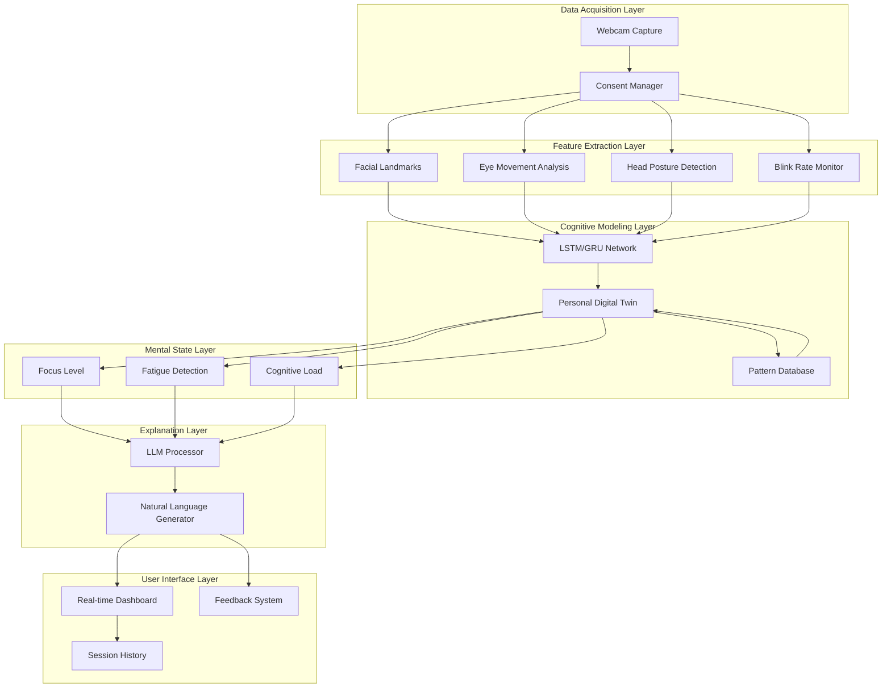
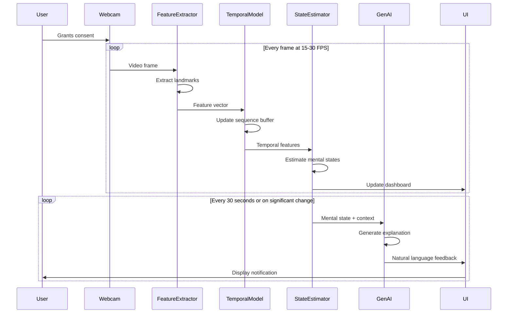
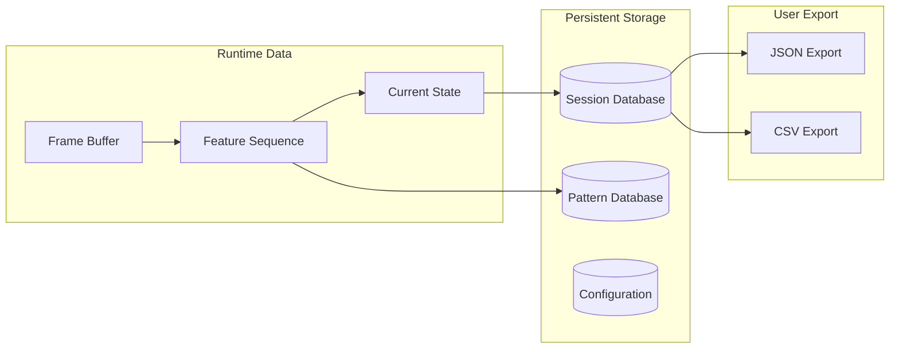
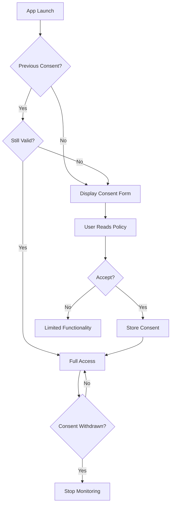
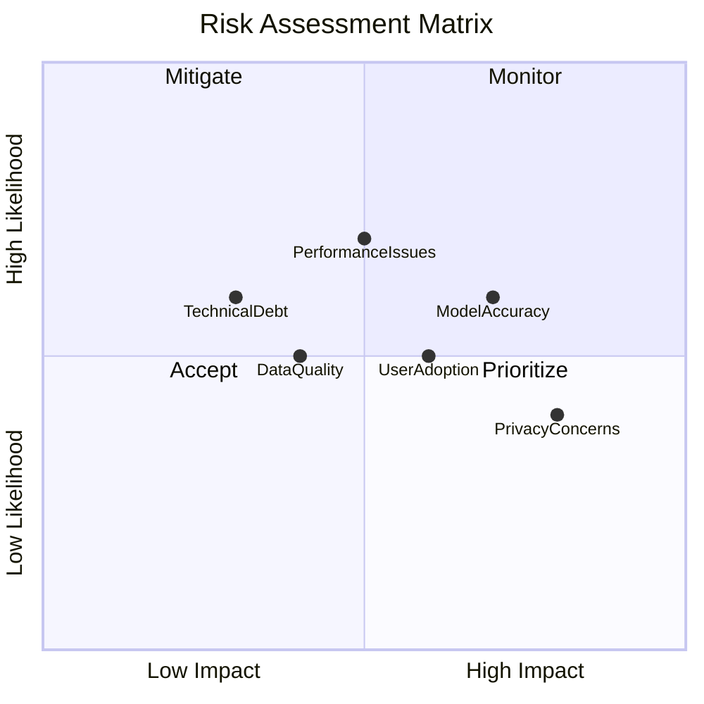
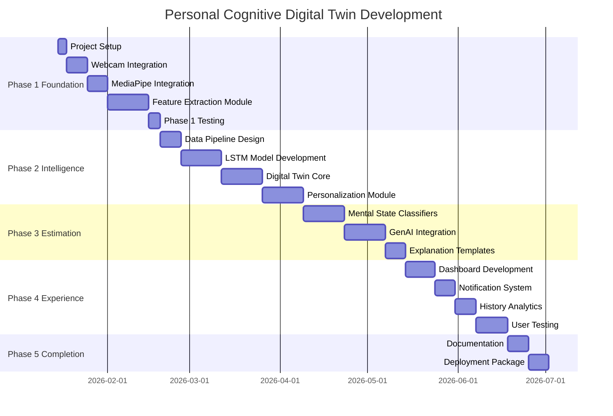

# Product Requirements Document (PRD)
## Personal Cognitive Digital Twin using Generative AI for Real-Time Mental State Monitoring

| Document Info | Details |
|---------------|---------|
| **Version** | 1.0 |
| **Date** | January 9, 2026 |
| **Status** | Draft |
| **Document Type** | Academic Research PRD |
| **Standard** | IEEE 830 Compliant |

---

## Table of Contents

1. [Executive Summary](#1-executive-summary)
2. [Problem Definition](#2-problem-definition)
3. [Goals and Objectives](#3-goals-and-objectives)
4. [Target Users and Personas](#4-target-users-and-personas)
5. [System Architecture](#5-system-architecture)
6. [Functional Requirements](#6-functional-requirements)
7. [Non-Functional Requirements](#7-non-functional-requirements)
8. [Technical Specifications](#8-technical-specifications)
9. [Data Flow Specification](#9-data-flow-specification)
10. [User Stories](#10-user-stories)
11. [Privacy and Ethics](#11-privacy-and-ethics)
12. [Risk Assessment](#12-risk-assessment)
13. [Success Metrics](#13-success-metrics)
14. [Development Roadmap](#14-development-roadmap)
15. [Appendices](#15-appendices)

---

## 1. Executive Summary

### 1.1 Project Vision

The **Personal Cognitive Digital Twin** is an innovative system that continuously monitors and explains a user's mental state in real-time using non-intrusive webcam-based analysis and Generative AI. By creating a personalized digital representation of an individual's cognitive patterns, the system provides actionable, human-understandable feedback to improve productivity and mental well-being.

### 1.2 Value Proposition

| Aspect | Traditional Approaches | Personal Cognitive Digital Twin |
|--------|----------------------|--------------------------------|
| **Intrusiveness** | Requires wearables, EEG, or manual input | Non-intrusive webcam-only approach |
| **Continuity** | Periodic assessments | Continuous real-time monitoring |
| **Personalization** | Generic models | Learns individual behavioral patterns |
| **Interpretability** | Numerical outputs | Natural language explanations via GenAI |
| **Accessibility** | Specialized equipment | Standard laptop webcam |

### 1.3 Key Differentiators

1. **Cognitive Digital Twin Concept**: Unlike snapshot-based detection systems, this creates a persistent, evolving model of the user's cognitive patterns
2. **GenAI-Powered Explanations**: Translates complex mental state data into simple, actionable guidance
3. **Privacy-First Design**: Local processing with optional cloud features
4. **Research-Backed Approach**: Built on extensive literature review of 32+ research papers
5. **Temporal Learning**: Captures gradual changes in mental state over time, not just momentary readings

### 1.4 Target Outcomes

- Enable users to maintain optimal cognitive performance during extended screen time
- Reduce mental fatigue through timely interventions
- Provide personalized insights that improve over time
- Contribute novel research to the intersection of digital twins, cognitive science, and GenAI

---

## 2. Problem Definition

### 2.1 Problem Statement

With the rapid increase in digital device usage, individuals spend extended periods working on laptops for learning, professional tasks, and communication. Prolonged screen time often leads to:

- **Mental fatigue**: Decreased cognitive performance over time
- **Reduced attention**: Difficulty maintaining focus on tasks
- **Increased cognitive load**: Overwhelm from information processing
- **Lack of self-awareness**: Users don't recognize their declining mental state

Users typically lack real-time awareness of their mental condition during task execution, which negatively impacts both productivity and well-being. By the time symptoms become noticeable (headaches, eye strain, irritability), significant cognitive decline has already occurred.

### 2.2 Current Solution Limitations

| Approach | Description | Limitations |
|----------|-------------|-------------|
| **Self-Report Questionnaires** | NASA-TLX, subjective ratings | Intrusive, discontinuous, retrospective bias |
| **EEG Monitoring** | Brainwave analysis | Expensive equipment, uncomfortable, lab setting required |
| **Heart Rate Monitors** | Physiological stress indicators | Requires wearables, indirect cognitive measures |
| **Existing Vision Systems** | Fatigue/emotion detection | Short-term only, no personalization, numerical outputs |
| **Productivity Apps** | Time tracking, break reminders | Rule-based, not adaptive, no cognitive awareness |

### 2.3 Gap Analysis from Literature Review

Based on the review of approximately 32 research papers, the following gaps were identified:

| Research Area | Current State | Gap Identified |
|---------------|---------------|----------------|
| Cognitive Load Assessment | Relies on intrusive sensors | Need for non-intrusive continuous monitoring |
| Vision-Based Detection | Short-term, non-personalized | Long-term personalized mental state modeling |
| Temporal Modeling | No persistent user representation | Persistent cognitive digital twin needed |
| Human Digital Twin | Focuses on physical systems | Limited cognitive behavior modeling |
| Explainable AI | Technical visualizations | User-friendly natural language explanations |
| Generative AI | Text generation applications | Rarely applied to cognitive monitoring |

### 2.4 Research Justification

This project addresses the identified gaps by proposing a **Personal Cognitive Digital Twin** that:

1. Uses deep learning to model real-time visual behavior non-intrusively
2. Builds a persistent, personalized model of user cognitive patterns
3. Employs Generative AI to generate simple, personalized explanations

---

## 3. Goals and Objectives

### 3.1 Primary Research Objectives

| ID | Objective | Measurable Outcome |
|----|-----------|-------------------|
| **O1** | Capture real-time visual behavioral cues using a standard laptop webcam | Successfully extract features from webcam at ≥15 FPS |
| **O2** | Extract meaningful facial, eye, and head movement features using deep learning | Achieve landmark detection accuracy ≥95% |
| **O3** | Model temporal behavioral patterns and build a personalized cognitive digital twin | Demonstrate improved prediction accuracy after personalization period |
| **O4** | Estimate mental states (focus, fatigue, cognitive load) in real time | Achieve correlation ≥0.7 with validated self-report measures |
| **O5** | Generate natural language feedback using Generative AI | User comprehension rate ≥90% in usability testing |

### 3.2 Success Criteria

**Technical Success:**
- Real-time processing with latency <100ms per frame
- Model accuracy improvement of ≥15% after 1-week personalization
- System operates on standard laptops without dedicated GPU

**User Success:**
- Users report improved awareness of mental state
- Positive user experience ratings (SUS score ≥68)
- Users take recommended breaks/actions ≥50% of the time

**Research Success:**
- Novel contribution to digital twin and cognitive monitoring literature
- Publishable findings on GenAI-driven cognitive explanation

### 3.3 Scope Definition

#### In-Scope

| Category | Items |
|----------|-------|
| **Visual Features** | Facial landmarks, eye gaze, blink rate, head pose |
| **Mental States** | Focus level, fatigue, cognitive load |
| **Feedback** | Natural language explanations, real-time notifications |
| **User Interface** | Desktop dashboard, session history, privacy controls |
| **Personalization** | Temporal learning, individual pattern recognition |

#### Out-of-Scope

| Category | Items | Rationale |
|----------|-------|-----------|
| **Physiological Sensors** | Heart rate, EEG, GSR | Maintains non-intrusive approach |
| **Mobile Deployment** | iOS/Android apps | Focus on laptop usage scenario |
| **Clinical Diagnosis** | Mental health conditions | Ethical and regulatory constraints |
| **Multi-User Modeling** | Shared cognitive models | Privacy and personalization focus |
| **Audio Analysis** | Voice stress detection | Scope limitation for initial version |

---

## 4. Target Users and Personas

### 4.1 Primary User Segments

| Segment | Description | Size Estimate |
|---------|-------------|---------------|
| **Knowledge Workers** | Professionals with extended screen time | Large |
| **Students** | Learners engaged in online education | Large |
| **Researchers** | Academics requiring sustained focus | Medium |
| **Remote Workers** | Work-from-home professionals | Large |

### 4.2 Secondary User Segments

| Segment | Description | Use Case |
|---------|-------------|----------|
| **Mental Health Practitioners** | Therapists, counselors | Client monitoring tool |
| **Organizations** | HR, wellness programs | Aggregate insights (anonymized) |
| **Gamers/Streamers** | Extended screen sessions | Performance optimization |

### 4.3 User Personas

#### Persona 1: Priya - Graduate Research Student

| Attribute | Details |
|-----------|---------|
| **Age** | 26 |
| **Occupation** | PhD Student in Computer Science |
| **Technical Proficiency** | High |
| **Daily Screen Time** | 10-12 hours |
| **Pain Points** | Loses track of time while coding, experiences burnout, difficulty recognizing when to take breaks |
| **Goals** | Maintain productivity without sacrificing mental health, complete thesis on schedule |
| **Quote** | "I know I should take breaks, but I never notice when I'm getting tired until it's too late." |

**User Journey:**
1. Priya starts her work session and activates the Cognitive Twin
2. System monitors her focus levels during coding
3. After 2 hours, system detects declining focus and increased fatigue
4. GenAI generates message: "Your focus has gradually decreased over the past 30 minutes. Consider a 10-minute break to reset."
5. Priya takes a break and returns with improved productivity

#### Persona 2: Rajesh - Corporate Professional

| Attribute | Details |
|-----------|---------|
| **Age** | 38 |
| **Occupation** | Senior Project Manager |
| **Technical Proficiency** | Medium |
| **Daily Screen Time** | 8-10 hours (mostly meetings) |
| **Pain Points** | Back-to-back video calls, decision fatigue, evening exhaustion |
| **Goals** | Better work-life balance, sustainable performance |
| **Quote** | "After a day of meetings, I can't think straight. I need something that tells me when I'm overloaded." |

**User Journey:**
1. Rajesh has a day full of video conferences
2. System tracks cognitive load through facial expressions and attention patterns
3. After the fourth consecutive meeting, system detects high cognitive load
4. GenAI generates: "Your cognitive load is elevated. You've been in focused attention mode for 3 hours. Scheduling a 15-minute gap before your next call could improve decision quality."
5. Rajesh adjusts his schedule based on feedback

#### Persona 3: Ananya - Online Learning Student

| Attribute | Details |
|-----------|---------|
| **Age** | 19 |
| **Occupation** | Undergraduate Student (Remote Learning) |
| **Technical Proficiency** | Medium |
| **Daily Screen Time** | 6-8 hours |
| **Pain Points** | Difficulty staying engaged during online lectures, frequent distractions, poor study habits |
| **Goals** | Improve academic performance, develop better study discipline |
| **Quote** | "I zone out during online classes and don't even realize it. I need something to keep me accountable." |

**User Journey:**
1. Ananya starts an online lecture with Cognitive Twin active
2. System tracks eye gaze and attention patterns
3. System detects attention drift after 20 minutes
4. GenAI generates: "Your attention seems to be wandering. Try taking quick notes or adjusting your posture."
5. Ananya refocuses and engagement improves

---

## 5. System Architecture

### 5.1 High-Level Architecture

The system consists of six interconnected layers, each responsible for a specific aspect of the cognitive monitoring pipeline.



### 5.2 Layer Descriptions

#### Layer 1: Data Acquisition
- **Purpose**: Capture video input with user consent
- **Components**: Webcam interface, consent management, frame buffering
- **Output**: Raw video frames at 15-30 FPS

#### Layer 2: Feature Extraction
- **Purpose**: Extract meaningful behavioral features from video frames
- **Components**: 
  - MediaPipe Face Mesh (468 facial landmarks)
  - Eye gaze estimation module
  - Blink detection algorithm
  - Head pose estimation (pitch, yaw, roll)
- **Output**: Feature vectors per frame

#### Layer 3: Cognitive Modeling
- **Purpose**: Build personalized temporal patterns
- **Components**:
  - LSTM/GRU temporal network
  - Personal pattern database
  - Adaptive learning module
- **Output**: Cognitive state embeddings

#### Layer 4: Mental State Estimation
- **Purpose**: Classify current mental states
- **Components**:
  - Focus level estimator
  - Fatigue detector
  - Cognitive load classifier
- **Output**: Mental state scores (0-100 scale)

#### Layer 5: Explanation Generation
- **Purpose**: Convert technical outputs to human-readable feedback
- **Components**:
  - Context builder
  - LLM interface (local/cloud)
  - Response generator
- **Output**: Natural language explanations

#### Layer 6: User Interface
- **Purpose**: Present information and collect user feedback
- **Components**:
  - Real-time dashboard
  - Notification system
  - Session history viewer
  - Privacy settings

### 5.3 Deployment Options

| Option | Processing | GenAI | Use Case |
|--------|------------|-------|----------|
| **Fully Local** | Local (CPU/GPU) | Ollama (local LLM) | Maximum privacy, offline capable |
| **Hybrid (Free)** | Local | OpenRouter (free models) | No cost, good quality |
| **Hybrid (Premium)** | Local | Cloud API (OpenAI/Anthropic) | Balance of privacy and capability |
| **Research Cloud** | Cloud GPU | Cloud API | Large-scale studies, maximum performance |

---

## 6. Functional Requirements

### 6.1 Requirements Overview

| ID | Requirement | Priority | Module |
|----|-------------|----------|--------|
| FR1 | Real-time video capture with consent | Must Have | Data Acquisition |
| FR2 | Facial landmark extraction (468 points) | Must Have | Feature Extraction |
| FR3 | Eye gaze and blink detection | Must Have | Feature Extraction |
| FR4 | Head pose estimation | Must Have | Feature Extraction |
| FR5 | Temporal pattern learning | Must Have | Cognitive Modeling |
| FR6 | Mental state estimation | Must Have | State Estimation |
| FR7 | Natural language explanation | Must Have | GenAI |
| FR8 | User feedback interface | Must Have | UI |
| FR9 | Session history and analytics | Should Have | UI |
| FR10 | Privacy controls and data management | Must Have | System-wide |

### 6.2 Detailed Requirements

#### FR1: Real-Time Video Capture with Consent

| Attribute | Specification |
|-----------|---------------|
| **Description** | System shall capture video from the default webcam only after explicit user consent |
| **Input** | User consent action (button click) |
| **Output** | Continuous video stream at 15-30 FPS |
| **Acceptance Criteria** | - Clear consent prompt displayed before capture begins<br>- User can revoke consent at any time<br>- No frames captured before consent granted<br>- Visual indicator when camera is active |

#### FR2: Facial Landmark Extraction

| Attribute | Specification |
|-----------|---------------|
| **Description** | System shall detect and track 468 facial landmarks in real-time |
| **Input** | Video frame (RGB) |
| **Output** | 468 3D landmark coordinates |
| **Technology** | MediaPipe Face Mesh |
| **Acceptance Criteria** | - Detection accuracy ≥95% on frontal faces<br>- Processing time <50ms per frame<br>- Graceful handling of face absence |

#### FR3: Eye Gaze and Blink Detection

| Attribute | Specification |
|-----------|---------------|
| **Description** | System shall track eye gaze direction and detect blink events |
| **Input** | Facial landmarks (eye region) |
| **Output** | Gaze vector (x, y), blink events, blink rate (blinks/minute) |
| **Acceptance Criteria** | - Gaze estimation accuracy within 5° error<br>- Blink detection precision ≥90%<br>- Real-time blink rate calculation |

#### FR4: Head Pose Estimation

| Attribute | Specification |
|-----------|---------------|
| **Description** | System shall estimate head orientation in 3D space |
| **Input** | Facial landmarks |
| **Output** | Pitch, yaw, roll angles in degrees |
| **Acceptance Criteria** | - Estimation accuracy within 5° error<br>- Stable tracking without jitter<br>- Handle partial occlusions |

#### FR5: Temporal Pattern Learning

| Attribute | Specification |
|-----------|---------------|
| **Description** | System shall learn user-specific temporal behavioral patterns |
| **Input** | Sequence of feature vectors |
| **Output** | Updated personal cognitive model |
| **Technology** | LSTM/GRU neural network |
| **Acceptance Criteria** | - Model adapts to individual patterns over time<br>- Prediction accuracy improves with usage<br>- Model persists between sessions |

#### FR6: Mental State Estimation

| Attribute | Specification |
|-----------|---------------|
| **Description** | System shall estimate focus, fatigue, and cognitive load levels |
| **Input** | Temporal cognitive features |
| **Output** | Three scores (0-100): focus_level, fatigue_level, cognitive_load |
| **Acceptance Criteria** | - Updates every 1-5 seconds<br>- Correlates with self-reported states (r ≥ 0.7)<br>- Distinguishes between different mental states |

#### FR7: Natural Language Explanation Generation

| Attribute | Specification |
|-----------|---------------|
| **Description** | System shall generate human-readable explanations of mental states |
| **Input** | Mental state scores, context, user history |
| **Output** | Natural language feedback message |
| **Technology** | LLM (OpenAI API, OpenRouter free models, or Ollama local) |
| **Acceptance Criteria** | - Explanations are understandable by non-technical users<br>- Personalized to user patterns<br>- Includes actionable suggestions<br>- Generation time <3 seconds |

#### FR8: User Feedback Interface

| Attribute | Specification |
|-----------|---------------|
| **Description** | System shall display real-time feedback and allow user interaction |
| **Components** | - Real-time mental state display<br>- Notification popups<br>- Feedback acknowledgment buttons |
| **Acceptance Criteria** | - Non-intrusive notifications<br>- User can dismiss/snooze alerts<br>- Clear visual indicators |

#### FR9: Session History and Analytics

| Attribute | Specification |
|-----------|---------------|
| **Description** | System shall store and display historical session data |
| **Components** | - Session timeline<br>- Daily/weekly summaries<br>- Trend visualization |
| **Acceptance Criteria** | - Data stored locally by default<br>- Export functionality<br>- Clear visualizations |

#### FR10: Privacy Controls and Data Management

| Attribute | Specification |
|-----------|---------------|
| **Description** | System shall provide comprehensive privacy controls |
| **Components** | - Data retention settings<br>- Export/delete data<br>- Consent management<br>- Processing location selection |
| **Acceptance Criteria** | - No raw video stored by default<br>- User can delete all data<br>- Clear privacy policy display |

---

## 7. Non-Functional Requirements

### 7.1 Performance Requirements

| ID | Requirement | Specification | Rationale |
|----|-------------|---------------|-----------|
| NFR-P1 | Frame processing rate | ≥15 FPS | Real-time visual analysis |
| NFR-P2 | End-to-end latency | <100ms per frame | Responsive system |
| NFR-P3 | GenAI response time | <3 seconds | User experience |
| NFR-P4 | Memory usage | <2GB RAM | Standard laptop compatibility |
| NFR-P5 | CPU usage | <50% average | Background operation |

### 7.2 Privacy Requirements

| ID | Requirement | Specification |
|----|-------------|---------------|
| NFR-PR1 | Local-first processing | All CV processing local by default |
| NFR-PR2 | Explicit consent | Required before any data collection |
| NFR-PR3 | No raw video storage | Only processed features stored |
| NFR-PR4 | Data minimization | Only necessary data collected |
| NFR-PR5 | User data control | Export and delete capabilities |

### 7.3 Accuracy Requirements

| ID | Metric | Target | Measurement Method |
|----|--------|--------|-------------------|
| NFR-A1 | Facial landmark detection | ≥95% accuracy | Benchmark dataset evaluation |
| NFR-A2 | Blink detection | ≥90% precision | Manual annotation comparison |
| NFR-A3 | Mental state correlation | r ≥ 0.7 | Self-report questionnaire correlation |
| NFR-A4 | Personalization improvement | ≥15% after 1 week | Before/after accuracy comparison |

### 7.4 Usability Requirements

| ID | Requirement | Specification |
|----|-------------|---------------|
| NFR-U1 | Setup time | <5 minutes for first use |
| NFR-U2 | Learning curve | Usable without training |
| NFR-U3 | Accessibility | WCAG 2.1 AA compliance |
| NFR-U4 | SUS score | ≥68 (above average) |

### 7.5 Reliability Requirements

| ID | Requirement | Specification |
|----|-------------|---------------|
| NFR-R1 | Uptime | 99% during active sessions |
| NFR-R2 | Error recovery | Automatic recovery from transient failures |
| NFR-R3 | Data integrity | No data loss on crashes |
| NFR-R4 | Graceful degradation | Continues with reduced features if components fail |

### 7.6 Compatibility Requirements

| ID | Requirement | Specification |
|----|-------------|---------------|
| NFR-C1 | Operating Systems | Windows 10+, macOS 11+, Ubuntu 20.04+ |
| NFR-C2 | Python version | 3.10+ |
| NFR-C3 | Webcam | Standard USB/integrated webcam |
| NFR-C4 | Hardware | 8GB RAM, modern CPU (no GPU required) |

---

## 8. Technical Specifications

### 8.1 Technology Stack

| Component | Technology | Version | Justification |
|-----------|------------|---------|---------------|
| **Language** | Python | 3.10+ | ML ecosystem, research standard, cross-platform |
| **CV Library** | OpenCV | 4.8+ | Industry standard, real-time performance |
| **Face Analysis** | MediaPipe | 0.10+ | State-of-art face mesh, efficient |
| **DL Framework** | PyTorch | 2.0+ | Research flexibility, dynamic graphs |
| **Temporal Model** | LSTM/GRU | (PyTorch) | Sequential pattern learning, proven effectiveness |
| **GenAI (Cloud)** | OpenAI API | GPT-4 | High-quality explanations |
| **GenAI (Cloud Free)** | OpenRouter | Llama 3.1 8B | Free tier, good quality |
| **GenAI (Local)** | Ollama | Latest | Privacy-first alternative |
| **UI Framework** | Streamlit | 1.30+ | Rapid prototyping, Python native |
| **Desktop UI** | PyQt6 | 6.6+ | Native look, system tray support |
| **Data Storage** | SQLite | 3.40+ | Lightweight, no server needed |
| **Data Format** | JSON | - | Configuration and interchange |
| **Data Processing** | NumPy, Pandas | Latest | Numerical operations, data handling |

### 8.2 Model Specifications

#### 8.2.1 Feature Extraction Model

```
Input: RGB Frame (640x480)
├── MediaPipe Face Mesh
│   └── Output: 468 landmarks (x, y, z)
├── Eye Region Extraction
│   ├── Left eye: 16 landmarks
│   ├── Right eye: 16 landmarks
│   └── Output: EAR (Eye Aspect Ratio), gaze vector
├── Head Pose Estimation
│   └── Output: pitch, yaw, roll (degrees)
└── Combined Feature Vector: 32 dimensions
```

#### 8.2.2 Temporal Cognitive Model

```
Architecture: Bidirectional LSTM
├── Input: Sequence of 60 feature vectors (2 seconds @ 30 FPS)
├── LSTM Layer 1: 128 units, bidirectional
├── LSTM Layer 2: 64 units, bidirectional
├── Attention Layer: Self-attention mechanism
├── Dense Layer: 32 units, ReLU
└── Output Layer: 3 units (focus, fatigue, cognitive_load)
```

#### 8.2.3 Personal Digital Twin Model

```
Components:
├── Base Model: Pre-trained on general population
├── Personal Adapter: User-specific fine-tuning layers
├── Pattern Database: SQLite storage of user patterns
└── Continual Learning: Online adaptation without catastrophic forgetting
```

### 8.3 API Specifications

#### 8.3.1 Feature Extraction API

```python
class FeatureExtractor:
    def __init__(self, config: FeatureConfig) -> None: ...
    def extract(self, frame: np.ndarray) -> FeatureVector: ...
    def get_landmarks(self, frame: np.ndarray) -> LandmarkData: ...
    def get_eye_features(self, landmarks: LandmarkData) -> EyeFeatures: ...
    def get_head_pose(self, landmarks: LandmarkData) -> HeadPose: ...
```

#### 8.3.2 Cognitive Model API

```python
class CognitiveDigitalTwin:
    def __init__(self, user_id: str, config: TwinConfig) -> None: ...
    def update(self, features: FeatureVector) -> MentalState: ...
    def get_state(self) -> MentalState: ...
    def save(self, path: str) -> None: ...
    def load(self, path: str) -> None: ...
    def adapt(self, feedback: UserFeedback) -> None: ...
```

#### 8.3.3 GenAI Explanation API

```python
class ExplanationGenerator:
    def __init__(self, config: GenAIConfig) -> None: ...
    def generate(self, state: MentalState, context: UserContext) -> str: ...
    def set_provider(self, provider: str) -> None: ...  # 'openai' or 'ollama'
```

### 8.4 Data Structures

#### 8.4.1 Feature Vector

```python
@dataclass
class FeatureVector:
    timestamp: float
    facial_landmarks: np.ndarray  # Shape: (468, 3)
    eye_aspect_ratio_left: float
    eye_aspect_ratio_right: float
    gaze_direction: Tuple[float, float]
    blink_detected: bool
    head_pitch: float
    head_yaw: float
    head_roll: float
    face_detected: bool
```

#### 8.4.2 Mental State

```python
@dataclass
class MentalState:
    timestamp: float
    focus_level: float  # 0-100
    fatigue_level: float  # 0-100
    cognitive_load: float  # 0-100
    confidence: float  # 0-1
    trend: str  # 'improving', 'stable', 'declining'
```

#### 8.4.3 User Context

```python
@dataclass
class UserContext:
    session_duration: float  # seconds
    time_of_day: str
    recent_states: List[MentalState]
    user_preferences: Dict[str, Any]
    personal_patterns: Dict[str, Any]
```

### 8.5 Configuration Schema

```json
{
  "acquisition": {
    "camera_id": 0,
    "frame_width": 640,
    "frame_height": 480,
    "target_fps": 30
  },
  "feature_extraction": {
    "min_detection_confidence": 0.5,
    "min_tracking_confidence": 0.5,
    "enable_attention_mesh": true
  },
  "cognitive_model": {
    "sequence_length": 60,
    "model_type": "lstm",
    "personalization_enabled": true,
    "adaptation_rate": 0.01
  },
  "genai": {
    "provider": "openrouter",
    "model": "meta-llama/llama-3.1-8b-instruct:free",
    "api_key": null,
    "base_url": "https://openrouter.ai/api/v1",
    "max_tokens": 150,
    "temperature": 0.7
  },
  "ui": {
    "notification_interval": 30,
    "enable_sounds": false,
    "theme": "system"
  },
  "privacy": {
    "store_raw_video": false,
    "data_retention_days": 30,
    "local_processing_only": true
  }
}
```

---

## 9. Data Flow Specification

### 9.1 Real-Time Processing Flow



### 9.2 Data Pipeline Stages

| Stage | Input | Processing | Output | Frequency |
|-------|-------|------------|--------|-----------|
| **Capture** | Camera stream | Frame acquisition | RGB frame | 30 FPS |
| **Detection** | RGB frame | Face mesh detection | 468 landmarks | 30 FPS |
| **Feature Extraction** | Landmarks | Compute derived features | Feature vector (32D) | 30 FPS |
| **Buffering** | Feature vectors | Maintain sliding window | Sequence (60 frames) | 30 FPS |
| **Temporal Analysis** | Feature sequence | LSTM processing | Cognitive embedding | 30 FPS |
| **State Estimation** | Cognitive embedding | Classification | Mental state scores | 1 Hz |
| **Explanation** | Mental state + context | LLM generation | Natural language | 0.03 Hz |
| **Presentation** | All outputs | UI rendering | Visual display | 60 FPS |

### 9.3 Data Storage Flow



---

## 10. User Stories

### 10.1 Epic: Real-Time Monitoring

#### US-1.1: Start Monitoring Session
> **As a** knowledge worker  
> **I want to** start a monitoring session with a single click  
> **So that** I can begin tracking my mental state without disruption

**Acceptance Criteria:**
- [ ] One-click session start from dashboard
- [ ] Clear visual confirmation of active monitoring
- [ ] Camera permission request on first use
- [ ] Session timer visible

**Priority:** Must Have

#### US-1.2: View Real-Time Mental State
> **As a** user  
> **I want to** see my current focus, fatigue, and cognitive load levels  
> **So that** I can understand my mental state at a glance

**Acceptance Criteria:**
- [ ] Three gauges/indicators for each mental state
- [ ] Updates at least every second
- [ ] Color-coded status (green/yellow/red)
- [ ] Trend arrows (improving/declining/stable)

**Priority:** Must Have

#### US-1.3: Receive Break Recommendations
> **As a** student studying for long periods  
> **I want to** receive timely break recommendations  
> **So that** I can maintain optimal cognitive performance

**Acceptance Criteria:**
- [ ] Notification when fatigue exceeds threshold
- [ ] Suggested break duration based on session length
- [ ] Option to snooze reminder
- [ ] Track breaks taken

**Priority:** Must Have

### 10.2 Epic: Natural Language Feedback

#### US-2.1: Understand Mental State Explanation
> **As a** non-technical user  
> **I want to** receive plain English explanations of my mental state  
> **So that** I can understand what the numbers mean

**Acceptance Criteria:**
- [ ] Explanation uses simple, non-technical language
- [ ] Includes specific observations (e.g., "your blink rate has increased")
- [ ] Provides context (e.g., "this often indicates eye strain")
- [ ] Offers actionable suggestion

**Priority:** Must Have

#### US-2.2: Personalized Feedback
> **As a** regular user  
> **I want to** receive feedback that reflects my personal patterns  
> **So that** the guidance is relevant to my specific situation

**Acceptance Criteria:**
- [ ] System references user's typical patterns
- [ ] Acknowledges improvements over time
- [ ] Adapts language to user preferences
- [ ] Remembers previous feedback effectiveness

**Priority:** Should Have

### 10.3 Epic: Privacy Control

#### US-3.1: Control Data Storage
> **As a** privacy-conscious user  
> **I want to** control what data is stored and for how long  
> **So that** I maintain ownership of my personal information

**Acceptance Criteria:**
- [ ] Data retention period setting
- [ ] Option to disable all storage
- [ ] Clear indication of what is stored
- [ ] Easy data deletion option

**Priority:** Must Have

#### US-3.2: Local-Only Processing
> **As a** user concerned about data security  
> **I want to** use the system entirely offline  
> **So that** my data never leaves my computer

**Acceptance Criteria:**
- [ ] Fully functional without internet
- [ ] Local LLM option (Ollama)
- [ ] No external API calls in local mode
- [ ] Clear indication of processing location

**Priority:** Should Have

### 10.4 Epic: Session History

#### US-4.1: Review Past Sessions
> **As a** user tracking my productivity  
> **I want to** review my mental state history  
> **So that** I can identify patterns over time

**Acceptance Criteria:**
- [ ] Session list with date/time
- [ ] Visual timeline of mental states
- [ ] Key events highlighted
- [ ] Session comparison feature

**Priority:** Should Have

#### US-4.2: Export Data
> **As a** researcher  
> **I want to** export my session data  
> **So that** I can analyze it with external tools

**Acceptance Criteria:**
- [ ] Export to CSV format
- [ ] Export to JSON format
- [ ] Select date range
- [ ] Include all metrics

**Priority:** Could Have

### 10.5 User Story Priority Summary

| Priority | Stories | Description |
|----------|---------|-------------|
| **Must Have** | US-1.1, US-1.2, US-1.3, US-2.1, US-3.1 | Core functionality |
| **Should Have** | US-2.2, US-3.2, US-4.1 | Enhanced experience |
| **Could Have** | US-4.2 | Advanced features |

---

## 11. Privacy and Ethics

### 11.1 Privacy Principles

The system adheres to **Privacy by Design** principles:

| Principle | Implementation |
|-----------|----------------|
| **Proactive Prevention** | Privacy considered from the design phase |
| **Default Settings** | Most private options enabled by default |
| **Embedded into Design** | Privacy features integral, not add-ons |
| **Full Functionality** | No trade-off between privacy and features |
| **End-to-End Security** | Data protected throughout lifecycle |
| **Visibility/Transparency** | Clear communication of data practices |
| **User-Centric** | User control over their data |

### 11.2 Data Collection Transparency

| Data Type | Collected | Stored | Purpose | Retention |
|-----------|-----------|--------|---------|-----------|
| Raw video frames | Yes (transient) | No | Feature extraction | <1 second |
| Facial landmarks | Yes | Optional | Pattern learning | User-defined |
| Mental state scores | Yes | Yes | History/analytics | User-defined |
| Session metadata | Yes | Yes | User experience | User-defined |
| GenAI prompts/responses | Yes | Optional | Debugging | 7 days |

### 11.3 Consent Mechanism



### 11.4 User Data Rights

Users have the following rights over their data:

| Right | Implementation |
|-------|----------------|
| **Access** | View all stored data in dashboard |
| **Portability** | Export data in standard formats |
| **Rectification** | Edit user profile and preferences |
| **Erasure** | Delete all personal data |
| **Restriction** | Limit processing to specific features |
| **Objection** | Opt-out of personalization |

### 11.5 Ethical Considerations

#### 11.5.1 Potential Misuse Prevention

| Risk | Mitigation |
|------|------------|
| Workplace surveillance | No remote access, personal use only |
| Discrimination | No demographic data collected |
| Psychological harm | Supportive messaging, no negative labeling |
| Addiction/dependency | Session time limits, healthy usage prompts |

#### 11.5.2 Research Ethics

- Obtain IRB approval before user studies
- Informed consent for all participants
- Anonymization of any shared data
- No deception in system functionality
- Right to withdraw at any time

### 11.6 Compliance Considerations

| Regulation | Relevance | Approach |
|------------|-----------|----------|
| **GDPR** | EU users | Data minimization, consent, rights |
| **CCPA** | California users | Disclosure, opt-out, deletion |
| **HIPAA** | If health claims made | Avoid medical claims, not a medical device |

---

## 12. Risk Assessment

### 12.1 Risk Matrix



### 12.2 Technical Risks

| Risk ID | Risk | Likelihood | Impact | Mitigation Strategy |
|---------|------|------------|--------|---------------------|
| TR-1 | Model accuracy insufficient | Medium | High | Extensive validation, continuous improvement |
| TR-2 | Real-time performance issues | Medium | Medium | Optimization, hardware requirements |
| TR-3 | GenAI response quality | Low | Medium | Prompt engineering, fallback templates |
| TR-4 | Cross-platform compatibility | Medium | Medium | Early testing on all platforms |
| TR-5 | Webcam quality variations | High | Low | Adaptive preprocessing, quality detection |

### 12.3 User Adoption Risks

| Risk ID | Risk | Likelihood | Impact | Mitigation Strategy |
|---------|------|------------|--------|---------------------|
| UR-1 | Privacy concerns | Medium | High | Transparent policies, local processing |
| UR-2 | Notification fatigue | Medium | Medium | Customizable frequency, smart timing |
| UR-3 | Perceived inaccuracy | Medium | High | User feedback loop, explanation of limitations |
| UR-4 | Learning curve | Low | Medium | Intuitive design, onboarding tutorial |

### 12.4 Research Risks

| Risk ID | Risk | Likelihood | Impact | Mitigation Strategy |
|---------|------|------------|--------|---------------------|
| RR-1 | Validation challenges | Medium | High | Multiple validation methods |
| RR-2 | Ground truth collection | Medium | Medium | Validated questionnaire integration |
| RR-3 | Publication readiness | Low | High | Rigorous documentation, reproducibility |

### 12.5 Risk Response Plan

| Risk Level | Response | Action |
|------------|----------|--------|
| **Critical** (High/High) | Immediate action | Dedicate resources, daily monitoring |
| **High** (High/Med or Med/High) | Priority attention | Weekly review, contingency plans |
| **Medium** (Med/Med) | Active monitoring | Bi-weekly review, mitigation in progress |
| **Low** (Low/* or */Low) | Accept and monitor | Monthly review, document occurrence |

---

## 13. Success Metrics

### 13.1 Technical Metrics

| Metric | Target | Measurement Method | Frequency |
|--------|--------|-------------------|-----------|
| Frame processing rate | ≥15 FPS | Performance profiling | Continuous |
| Feature extraction latency | <50ms | Timer instrumentation | Continuous |
| Mental state correlation | r ≥ 0.7 | NASA-TLX comparison | Validation study |
| Personalization improvement | ≥15% | Before/after comparison | Weekly |
| System uptime | ≥99% | Error logging | Session |
| Memory usage | <2GB | Resource monitoring | Continuous |

### 13.2 User Experience Metrics

| Metric | Target | Measurement Method | Frequency |
|--------|--------|-------------------|-----------|
| System Usability Scale | ≥68 | SUS questionnaire | Post-study |
| Task completion rate | ≥95% | Usage analytics | Ongoing |
| Feature adoption rate | ≥80% | Feature usage tracking | Monthly |
| User satisfaction | ≥4/5 | In-app rating | Monthly |
| Recommendation follow-rate | ≥50% | Action tracking | Per notification |

### 13.3 Research Metrics

| Metric | Target | Measurement Method |
|--------|--------|-------------------|
| Novel contributions | ≥3 | Publication review |
| Reproducibility | 100% | Independent replication |
| Code quality | ≥80% coverage | Automated testing |
| Documentation completeness | 100% | Checklist audit |

### 13.4 Key Performance Indicators (KPIs)

| KPI | Definition | Target | Status Indicator |
|-----|------------|--------|------------------|
| **Real-Time Factor** | Processing time / real time | <1.0 | 🟢 <0.8, 🟡 0.8-1.0, 🔴 >1.0 |
| **Accuracy Score** | Weighted average of all accuracy metrics | ≥85% | 🟢 ≥85%, 🟡 70-85%, 🔴 <70% |
| **User Engagement** | Average session duration | ≥30 min | 🟢 ≥30, 🟡 15-30, 🔴 <15 |
| **Privacy Compliance** | Audit score | 100% | 🟢 100%, 🔴 <100% |

---

## 14. Development Roadmap

### 14.1 Phase Overview

| Phase | Duration | Focus | Deliverables |
|-------|----------|-------|--------------|
| **Phase 1** | 5 weeks | Foundation | Data acquisition, feature extraction |
| **Phase 2** | 7 weeks | Core Intelligence | Temporal modeling, digital twin |
| **Phase 3** | 5 weeks | Cognitive Estimation | Mental state estimation, GenAI |
| **Phase 4** | 5 weeks | User Experience | UI, testing, validation |
| **Phase 5** | 2 weeks | Completion | Documentation, deployment |

### 14.2 Detailed Timeline



### 14.3 Phase 1: Foundation (Weeks 1-5)

| Week | Tasks | Deliverables |
|------|-------|--------------|
| 1 | Project setup, environment configuration | Dev environment, CI/CD pipeline |
| 2 | Webcam integration, frame capture | Camera module with consent |
| 3 | MediaPipe Face Mesh integration | Landmark detection module |
| 4-5 | Feature extraction implementation | Complete feature extraction pipeline |

**Milestone 1:** Real-time feature extraction from webcam ✓

### 14.4 Phase 2: Core Intelligence (Weeks 6-12)

| Week | Tasks | Deliverables |
|------|-------|--------------|
| 6 | Data pipeline design, sequence handling | Data flow architecture |
| 7-8 | LSTM/GRU model development | Temporal model |
| 9-10 | Digital twin core implementation | User profile system |
| 11-12 | Personalization and adaptation | Online learning module |

**Milestone 2:** Functional cognitive digital twin ✓

### 14.5 Phase 3: Cognitive Estimation (Weeks 13-17)

| Week | Tasks | Deliverables |
|------|-------|--------------|
| 13-14 | Mental state classifiers | Focus, fatigue, cognitive load models |
| 15-16 | GenAI integration (OpenAI + Ollama) | Explanation generation |
| 17 | Prompt engineering, templates | Optimized prompts |

**Milestone 3:** Natural language mental state explanations ✓

### 14.6 Phase 4: User Experience (Weeks 18-22)

| Week | Tasks | Deliverables |
|------|-------|--------------|
| 18-19 | Dashboard development | Real-time UI |
| 20 | Notification system | Alert framework |
| 21 | History and analytics | Session history viewer |
| 22 | User testing, iteration | Usability report |

**Milestone 4:** Complete user-facing application ✓

### 14.7 Phase 5: Completion (Weeks 23-24)

| Week | Tasks | Deliverables |
|------|-------|--------------|
| 23 | Documentation, user guides | Complete documentation |
| 24 | Deployment packaging, final testing | Release package |

**Milestone 5:** Production-ready system ✓

---

## 15. Appendices

### Appendix A: Glossary

| Term | Definition |
|------|------------|
| **Cognitive Load** | Mental effort required for information processing |
| **Digital Twin** | Virtual representation that mirrors a real-world entity |
| **EAR (Eye Aspect Ratio)** | Metric for eye openness, used in blink detection |
| **Feature Vector** | Numerical representation of extracted visual features |
| **Focus Level** | Degree of attention directed toward a task |
| **GenAI** | Generative Artificial Intelligence |
| **LSTM** | Long Short-Term Memory, a recurrent neural network type |
| **MediaPipe** | Google's framework for building perception pipelines |
| **Mental State** | Cognitive and emotional condition at a point in time |
| **Personalization** | Adaptation of system behavior to individual users |

### Appendix B: Literature Review References

| # | Area | Key References |
|---|------|----------------|
| 1 | Cognitive Load | NASA-TLX, Paas FSPS, Sweller CLT |
| 2 | Vision-Based Detection | Facial Action Coding System (FACS) |
| 3 | Temporal Modeling | LSTM (Hochreiter), Attention mechanisms |
| 4 | Digital Twins | Grieves (2014), Tao et al. (2018) |
| 5 | Explainable AI | LIME, SHAP, attention visualization |
| 6 | Generative AI | GPT architecture, instruction tuning |

### Appendix C: Validation Questionnaires

**NASA Task Load Index (NASA-TLX) Subscales:**
- Mental Demand
- Physical Demand
- Temporal Demand
- Performance
- Effort
- Frustration

**System Usability Scale (SUS):**
- 10-item questionnaire
- Score range: 0-100
- Above 68 considered above average

### Appendix D: Configuration Parameters

See Section 8.5 for complete configuration schema.

### Appendix E: API Reference

See Section 8.3 for API specifications.

### Appendix F: Database Schema

```sql
-- Sessions Table
CREATE TABLE sessions (
    id INTEGER PRIMARY KEY AUTOINCREMENT,
    start_time DATETIME NOT NULL,
    end_time DATETIME,
    duration_seconds INTEGER,
    avg_focus REAL,
    avg_fatigue REAL,
    avg_cognitive_load REAL
);

-- Mental States Table
CREATE TABLE mental_states (
    id INTEGER PRIMARY KEY AUTOINCREMENT,
    session_id INTEGER REFERENCES sessions(id),
    timestamp DATETIME NOT NULL,
    focus_level REAL,
    fatigue_level REAL,
    cognitive_load REAL,
    confidence REAL
);

-- Explanations Table
CREATE TABLE explanations (
    id INTEGER PRIMARY KEY AUTOINCREMENT,
    session_id INTEGER REFERENCES sessions(id),
    timestamp DATETIME NOT NULL,
    mental_state_id INTEGER REFERENCES mental_states(id),
    explanation_text TEXT,
    user_acknowledged BOOLEAN DEFAULT FALSE
);

-- User Patterns Table
CREATE TABLE user_patterns (
    id INTEGER PRIMARY KEY AUTOINCREMENT,
    pattern_type TEXT,
    pattern_data BLOB,
    created_at DATETIME,
    updated_at DATETIME
);
```

---

## Document History

| Version | Date | Author | Changes |
|---------|------|--------|---------|
| 1.0 | 2026-01-09 | System | Initial PRD creation |

---

*This PRD follows IEEE 830 standards for software requirements specification and incorporates best practices from academic research documentation.*
