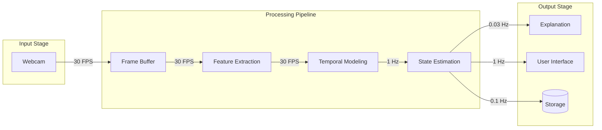
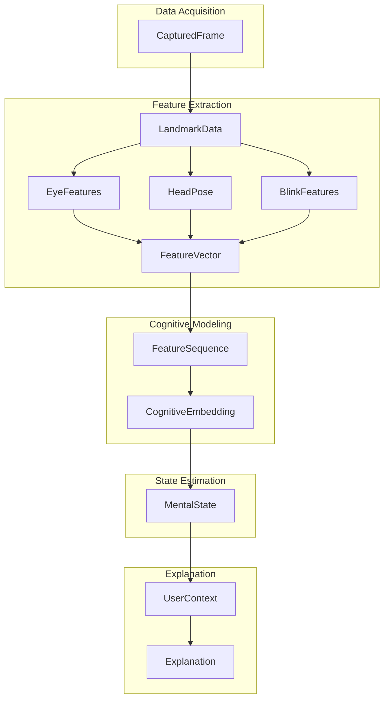
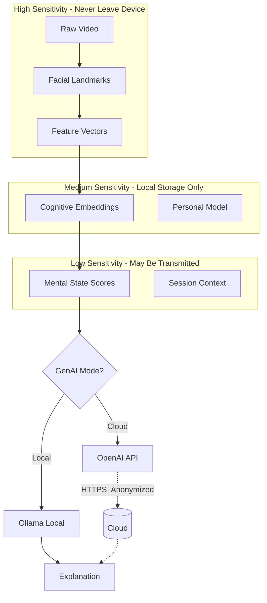

# Data Flow Specification
## Personal Cognitive Digital Twin

This document details the data pipeline, processing stages, and data management strategies for the Personal Cognitive Digital Twin system.

---

## Table of Contents

1. [Pipeline Overview](#1-pipeline-overview)
2. [Data Structures](#2-data-structures)
3. [Processing Stages](#3-processing-stages)
4. [Timing and Synchronization](#4-timing-and-synchronization)
5. [Storage and Persistence](#5-storage-and-persistence)
6. [Privacy-Preserving Data Flow](#6-privacy-preserving-data-flow)

---

## 1. Pipeline Overview

### 1.1 High-Level Data Flow



### 1.2 Data Volume Analysis

| Stage | Data Rate | Data Size | Retention |
|-------|-----------|-----------|-----------|
| Raw frames | 30 FPS | ~900 KB/frame | <100ms (transient) |
| Landmarks | 30 FPS | ~5.6 KB/frame | <2s (buffer) |
| Feature vectors | 30 FPS | ~128 bytes/frame | ~2s (sequence) |
| Mental states | 1 Hz | ~64 bytes/sample | Session + archive |
| Explanations | 0.03 Hz | ~500 bytes/message | Session + archive |

### 1.3 Pipeline Characteristics

| Property | Value | Notes |
|----------|-------|-------|
| End-to-end latency | <150ms | From capture to UI update |
| Processing frequency | 30 FPS | Feature extraction |
| State update frequency | 1 Hz | Mental state output |
| Explanation frequency | Every 30s | Or on significant change |
| Memory footprint | <500 MB | Active processing |

---

## 2. Data Structures

### 2.1 Core Data Classes

```python
from dataclasses import dataclass, field
from typing import List, Optional, Tuple, Dict, Any
from enum import Enum
import numpy as np

# ============================================
# Layer 1: Data Acquisition
# ============================================

@dataclass
class CapturedFrame:
    """Raw frame from webcam with metadata."""
    frame: np.ndarray           # Shape: (H, W, 3), dtype: uint8
    timestamp: float            # Unix timestamp (seconds)
    frame_id: int               # Sequential frame number
    camera_active: bool         # Camera status flag
    resolution: Tuple[int, int] # (width, height)
    
    def to_rgb(self) -> np.ndarray:
        """Convert BGR to RGB if needed."""
        return self.frame[:, :, ::-1]

# ============================================
# Layer 2: Feature Extraction
# ============================================

@dataclass
class LandmarkData:
    """MediaPipe Face Mesh landmarks."""
    landmarks: np.ndarray       # Shape: (468, 3) normalized coordinates
    confidence: float           # Detection confidence [0, 1]
    face_rect: Tuple[int, int, int, int]  # (x, y, w, h)
    timestamp: float

@dataclass
class EyeFeatures:
    """Eye-related extracted features."""
    ear_left: float             # Eye Aspect Ratio (left)
    ear_right: float            # Eye Aspect Ratio (right)
    ear_average: float          # Average EAR
    gaze_x: float               # Horizontal gaze direction [-1, 1]
    gaze_y: float               # Vertical gaze direction [-1, 1]
    pupil_ratio_left: float     # Pupil size indicator
    pupil_ratio_right: float    # Pupil size indicator
    eyes_closed: bool           # Both eyes closed flag

@dataclass
class HeadPose:
    """Head orientation in 3D space."""
    pitch: float                # Up/down rotation (degrees)
    yaw: float                  # Left/right rotation (degrees)
    roll: float                 # Tilt rotation (degrees)
    confidence: float           # Estimation confidence

@dataclass
class BlinkFeatures:
    """Blink detection features."""
    blink_detected: bool        # Current frame has blink
    blink_rate: float           # Blinks per minute (rolling)
    avg_blink_duration: float   # Average duration in ms
    time_since_last_blink: float  # Seconds since last blink

@dataclass
class FeatureVector:
    """Complete feature set for one frame."""
    timestamp: float
    frame_id: int
    
    # Component features
    landmarks: Optional[LandmarkData]
    eye_features: Optional[EyeFeatures]
    head_pose: Optional[HeadPose]
    blink_features: Optional[BlinkFeatures]
    
    # Quality indicators
    face_detected: bool
    face_confidence: float
    lighting_quality: float     # [0, 1] estimated lighting
    face_distance: float        # Estimated distance from camera
    
    def to_array(self) -> np.ndarray:
        """Convert to 32D numpy array for model input."""
        if not self.face_detected:
            return np.zeros(32, dtype=np.float32)
        
        features = []
        
        # Eye features (7)
        if self.eye_features:
            features.extend([
                self.eye_features.ear_left,
                self.eye_features.ear_right,
                self.eye_features.gaze_x,
                self.eye_features.gaze_y,
                self.eye_features.pupil_ratio_left,
                self.eye_features.pupil_ratio_right,
                1.0 if self.eye_features.eyes_closed else 0.0
            ])
        else:
            features.extend([0.0] * 7)
        
        # Blink features (3)
        if self.blink_features:
            features.extend([
                1.0 if self.blink_features.blink_detected else 0.0,
                self.blink_features.blink_rate / 30.0,  # Normalize
                self.blink_features.time_since_last_blink / 60.0  # Normalize
            ])
        else:
            features.extend([0.0] * 3)
        
        # Head pose (3)
        if self.head_pose:
            features.extend([
                self.head_pose.pitch / 45.0,  # Normalize to ~[-1, 1]
                self.head_pose.yaw / 45.0,
                self.head_pose.roll / 45.0
            ])
        else:
            features.extend([0.0] * 3)
        
        # Facial expression features - simplified AU activations (10)
        # Derived from landmark positions
        features.extend(self._compute_expression_features())
        
        # Motion features (6)
        features.extend([0.0] * 6)  # Computed from frame history
        
        # Quality features (3)
        features.extend([
            self.face_confidence,
            self.lighting_quality,
            min(1.0, self.face_distance / 100.0)  # Normalize distance
        ])
        
        return np.array(features[:32], dtype=np.float32)
    
    def _compute_expression_features(self) -> List[float]:
        """Compute simplified expression features from landmarks."""
        # Placeholder - actual implementation uses landmark geometry
        return [0.0] * 10

# ============================================
# Layer 3: Cognitive Modeling
# ============================================

@dataclass
class FeatureSequence:
    """Sequence of feature vectors for temporal modeling."""
    features: List[np.ndarray]  # List of 32D arrays
    timestamps: List[float]
    sequence_length: int = 60   # 2 seconds at 30 FPS
    
    def as_tensor(self) -> np.ndarray:
        """Convert to model input tensor."""
        # Pad or truncate to sequence_length
        arr = np.zeros((self.sequence_length, 32), dtype=np.float32)
        n = min(len(self.features), self.sequence_length)
        for i, f in enumerate(self.features[-n:]):
            arr[self.sequence_length - n + i] = f
        return arr
    
    def add(self, feature: np.ndarray, timestamp: float) -> None:
        """Add feature to sequence (sliding window)."""
        self.features.append(feature)
        self.timestamps.append(timestamp)
        if len(self.features) > self.sequence_length:
            self.features.pop(0)
            self.timestamps.pop(0)

@dataclass
class CognitiveEmbedding:
    """Output of temporal encoder - cognitive state representation."""
    embedding: np.ndarray       # Shape: (64,)
    timestamp: float
    sequence_quality: float     # Quality of input sequence

# ============================================
# Layer 4: Mental State Estimation
# ============================================

class Trend(Enum):
    """Mental state trend direction."""
    IMPROVING = "improving"
    STABLE = "stable"
    DECLINING = "declining"

@dataclass
class MentalState:
    """Current mental state estimation."""
    timestamp: float
    
    # Core mental states (0-100 scale)
    focus_level: float
    fatigue_level: float
    cognitive_load: float
    
    # Metadata
    confidence: float           # Overall prediction confidence [0, 1]
    trend: Trend                # Recent trend direction
    
    # Detailed sub-scores (optional)
    attention_score: Optional[float] = None
    engagement_score: Optional[float] = None
    stress_indicator: Optional[float] = None
    
    def to_dict(self) -> Dict[str, Any]:
        """Convert to dictionary for JSON serialization."""
        return {
            "timestamp": self.timestamp,
            "focus_level": round(self.focus_level, 1),
            "fatigue_level": round(self.fatigue_level, 1),
            "cognitive_load": round(self.cognitive_load, 1),
            "confidence": round(self.confidence, 2),
            "trend": self.trend.value
        }
    
    def get_primary_concern(self) -> Optional[str]:
        """Get the most concerning state, if any."""
        if self.fatigue_level > 70:
            return "high_fatigue"
        if self.cognitive_load > 80:
            return "high_cognitive_load"
        if self.focus_level < 30:
            return "low_focus"
        return None

# ============================================
# Layer 5: Explanation Generation
# ============================================

@dataclass
class UserContext:
    """Context for personalized explanation generation."""
    session_duration_minutes: float
    time_of_day: str            # "morning", "afternoon", "evening", "night"
    day_of_week: str
    recent_states: List[MentalState]  # Last N states
    
    # User profile
    user_preferences: Dict[str, Any]
    notification_style: str     # "minimal", "detailed", "encouraging"
    
    # Personal patterns
    typical_focus_range: Tuple[float, float]
    typical_fatigue_pattern: str
    best_performance_time: str
    
    def get_pattern_summary(self) -> str:
        """Generate summary of user patterns for LLM context."""
        return (
            f"Typical focus range: {self.typical_focus_range[0]:.0f}-"
            f"{self.typical_focus_range[1]:.0f}. "
            f"Usually performs best in the {self.best_performance_time}. "
            f"Fatigue pattern: {self.typical_fatigue_pattern}."
        )

@dataclass
class Explanation:
    """Natural language explanation from GenAI."""
    message: str                # Main explanation text
    timestamp: float
    
    # Metadata
    mental_state: MentalState   # State that triggered this
    suggestion: Optional[str]   # Actionable suggestion extracted
    urgency: str                # "info", "suggestion", "warning"
    
    # For debugging/improvement
    prompt_used: Optional[str] = None
    model_used: str = "unknown"
    generation_time_ms: float = 0.0

# ============================================
# Storage Models
# ============================================

@dataclass
class Session:
    """A monitoring session."""
    id: str
    start_time: float
    end_time: Optional[float]
    
    # Aggregated statistics
    avg_focus: float
    avg_fatigue: float
    avg_cognitive_load: float
    
    # Events
    explanations_count: int
    breaks_taken: int
    alerts_dismissed: int
    
    def duration_minutes(self) -> float:
        """Get session duration in minutes."""
        end = self.end_time or time.time()
        return (end - self.start_time) / 60.0

@dataclass
class UserPattern:
    """Learned user behavioral pattern."""
    pattern_type: str           # e.g., "focus_decay", "fatigue_onset"
    pattern_data: Dict[str, Any]
    confidence: float
    sample_count: int
    last_updated: float
```

### 2.2 Data Flow Diagram



---

## 3. Processing Stages

### 3.1 Stage 1: Frame Acquisition

```python
class FrameAcquisitionPipeline:
    """Captures and buffers frames from webcam."""
    
    def __init__(self, config: AcquisitionConfig):
        self.camera = CameraManager(config.camera_id)
        self.buffer = CircularBuffer(max_size=10)
        self.frame_counter = 0
        
    def process(self) -> Optional[CapturedFrame]:
        """Capture next frame."""
        ret, frame = self.camera.read()
        if not ret:
            return None
            
        captured = CapturedFrame(
            frame=frame,
            timestamp=time.time(),
            frame_id=self.frame_counter,
            camera_active=True,
            resolution=(frame.shape[1], frame.shape[0])
        )
        
        self.frame_counter += 1
        self.buffer.add(captured)
        
        return captured
```

**Processing Flow:**
1. Read frame from OpenCV VideoCapture
2. Create CapturedFrame with metadata
3. Add to circular buffer
4. Emit frame for next stage

### 3.2 Stage 2: Feature Extraction

```python
class FeatureExtractionPipeline:
    """Extracts all behavioral features from frames."""
    
    def __init__(self, config: FeatureConfig):
        self.face_mesh = mp.solutions.face_mesh.FaceMesh(
            max_num_faces=1,
            refine_landmarks=True,
            min_detection_confidence=config.min_detection_confidence,
            min_tracking_confidence=config.min_tracking_confidence
        )
        self.eye_analyzer = EyeAnalyzer()
        self.head_pose_estimator = HeadPoseEstimator()
        self.blink_detector = BlinkDetector()
        
    def process(self, frame: CapturedFrame) -> FeatureVector:
        """Extract features from a single frame."""
        
        # Step 1: Detect face mesh
        rgb_frame = frame.to_rgb()
        results = self.face_mesh.process(rgb_frame)
        
        if not results.multi_face_landmarks:
            return FeatureVector(
                timestamp=frame.timestamp,
                frame_id=frame.frame_id,
                landmarks=None,
                eye_features=None,
                head_pose=None,
                blink_features=None,
                face_detected=False,
                face_confidence=0.0,
                lighting_quality=self._estimate_lighting(frame.frame),
                face_distance=0.0
            )
        
        # Step 2: Extract landmark data
        landmarks = self._process_landmarks(results.multi_face_landmarks[0])
        
        # Step 3: Extract component features
        eye_features = self.eye_analyzer.analyze(landmarks)
        head_pose = self.head_pose_estimator.estimate(landmarks)
        blink_features = self.blink_detector.detect(landmarks, eye_features)
        
        # Step 4: Compute quality metrics
        face_confidence = self._compute_confidence(landmarks)
        lighting_quality = self._estimate_lighting(frame.frame)
        face_distance = self._estimate_distance(landmarks)
        
        return FeatureVector(
            timestamp=frame.timestamp,
            frame_id=frame.frame_id,
            landmarks=landmarks,
            eye_features=eye_features,
            head_pose=head_pose,
            blink_features=blink_features,
            face_detected=True,
            face_confidence=face_confidence,
            lighting_quality=lighting_quality,
            face_distance=face_distance
        )
```

**Feature Extraction Details:**

| Feature | Algorithm | Output Range |
|---------|-----------|--------------|
| EAR | Landmark distance ratio | [0, 0.5] |
| Gaze | Iris center relative to eye corners | [-1, 1] |
| Head pose | PnP solve with face model | [-90°, 90°] |
| Blink | EAR threshold crossing | Boolean |
| Blink rate | Rolling window counter | [0, 50] bpm |

### 3.3 Stage 3: Temporal Modeling

```python
class TemporalModelingPipeline:
    """Builds temporal representations of behavior."""
    
    def __init__(self, config: CognitiveConfig):
        self.sequence = FeatureSequence(
            features=[],
            timestamps=[],
            sequence_length=config.sequence_length
        )
        self.model = self._load_temporal_model(config.model_path)
        self.device = torch.device("cuda" if torch.cuda.is_available() else "cpu")
        
    def process(self, feature_vector: FeatureVector) -> CognitiveEmbedding:
        """Update sequence and generate embedding."""
        
        # Step 1: Add to sequence
        feature_array = feature_vector.to_array()
        self.sequence.add(feature_array, feature_vector.timestamp)
        
        # Step 2: Prepare input
        input_tensor = torch.tensor(
            self.sequence.as_tensor(),
            dtype=torch.float32
        ).unsqueeze(0).to(self.device)  # Add batch dimension
        
        # Step 3: Forward pass
        with torch.no_grad():
            embedding = self.model(input_tensor)
        
        # Step 4: Compute sequence quality
        sequence_quality = self._compute_quality()
        
        return CognitiveEmbedding(
            embedding=embedding.cpu().numpy().squeeze(),
            timestamp=feature_vector.timestamp,
            sequence_quality=sequence_quality
        )
    
    def _compute_quality(self) -> float:
        """Compute quality based on face detection rate."""
        if len(self.sequence.features) == 0:
            return 0.0
        # Count frames with valid face detection
        valid_count = sum(1 for f in self.sequence.features if np.any(f != 0))
        return valid_count / len(self.sequence.features)
```

**Temporal Model Architecture:**

```
Input Shape: (batch=1, seq_len=60, features=32)
                    │
                    ▼
    ┌───────────────────────────────┐
    │   Layer Normalization         │
    └───────────────────────────────┘
                    │
                    ▼
    ┌───────────────────────────────┐
    │   Bidirectional LSTM          │
    │   hidden_size=128             │
    │   num_layers=2                │
    │   dropout=0.3                 │
    └───────────────────────────────┘
                    │
                    ▼
    ┌───────────────────────────────┐
    │   Multi-Head Self-Attention   │
    │   num_heads=4                 │
    │   dropout=0.1                 │
    └───────────────────────────────┘
                    │
                    ▼
    ┌───────────────────────────────┐
    │   Global Average Pooling      │
    └───────────────────────────────┘
                    │
                    ▼
    ┌───────────────────────────────┐
    │   Dense(256, 64)              │
    │   ReLU + LayerNorm            │
    └───────────────────────────────┘
                    │
                    ▼
    Output Shape: (batch=1, embedding=64)
```

### 3.4 Stage 4: State Estimation

```python
class StateEstimationPipeline:
    """Estimates mental states from cognitive embeddings."""
    
    def __init__(self, config: EstimationConfig):
        self.focus_classifier = self._load_classifier("focus")
        self.fatigue_classifier = self._load_classifier("fatigue")
        self.cogload_classifier = self._load_classifier("cognitive_load")
        self.state_history = deque(maxlen=30)  # 30 seconds of history
        
    def process(self, embedding: CognitiveEmbedding) -> MentalState:
        """Estimate mental states from embedding."""
        
        emb_tensor = torch.tensor(embedding.embedding, dtype=torch.float32)
        
        with torch.no_grad():
            focus = self.focus_classifier(emb_tensor).item() * 100
            fatigue = self.fatigue_classifier(emb_tensor).item() * 100
            cogload = self.cogload_classifier(emb_tensor).item() * 100
        
        # Compute confidence based on embedding quality
        confidence = embedding.sequence_quality
        
        # Determine trend from history
        trend = self._compute_trend()
        
        state = MentalState(
            timestamp=embedding.timestamp,
            focus_level=focus,
            fatigue_level=fatigue,
            cognitive_load=cogload,
            confidence=confidence,
            trend=trend
        )
        
        self.state_history.append(state)
        
        return state
    
    def _compute_trend(self) -> Trend:
        """Compute trend from recent state history."""
        if len(self.state_history) < 10:
            return Trend.STABLE
        
        recent = list(self.state_history)[-10:]
        focus_change = recent[-1].focus_level - recent[0].focus_level
        
        if focus_change > 5:
            return Trend.IMPROVING
        elif focus_change < -5:
            return Trend.DECLINING
        else:
            return Trend.STABLE
```

### 3.5 Stage 5: Explanation Generation

```python
class ExplanationPipeline:
    """Generates natural language explanations."""
    
    # Supported providers: openrouter (free), openai, ollama
    PROVIDERS = {
        "openrouter": "OpenRouterProvider",  # Free models available
        "openai": "OpenAIProvider",
        "ollama": "OllamaProvider"  # Local, offline
    }
    
    def __init__(self, config: GenAIConfig):
        self.provider = self._init_provider(config)
        self.prompt_template = self._load_template(config.template_path)
        self.last_explanation_time = 0
        self.min_interval = config.min_interval_seconds
        
    def should_generate(self, state: MentalState) -> bool:
        """Determine if explanation should be generated."""
        time_elapsed = time.time() - self.last_explanation_time
        
        # Always generate if significant change
        if state.get_primary_concern():
            return True
            
        # Otherwise respect minimum interval
        return time_elapsed >= self.min_interval
    
    async def process(self, state: MentalState, 
                      context: UserContext) -> Explanation:
        """Generate explanation for current state."""
        
        # Build prompt
        prompt = self.prompt_template.format(
            focus_level=state.focus_level,
            fatigue_level=state.fatigue_level,
            cognitive_load=state.cognitive_load,
            trend=state.trend.value,
            session_duration=context.session_duration_minutes,
            time_of_day=context.time_of_day,
            pattern_summary=context.get_pattern_summary()
        )
        
        # Generate response
        start_time = time.time()
        response = await self.provider.generate(prompt)
        generation_time = (time.time() - start_time) * 1000
        
        # Parse response
        message, suggestion, urgency = self._parse_response(response)
        
        self.last_explanation_time = time.time()
        
        return Explanation(
            message=message,
            timestamp=time.time(),
            mental_state=state,
            suggestion=suggestion,
            urgency=urgency,
            prompt_used=prompt,
            model_used=self.provider.model_name,
            generation_time_ms=generation_time
        )
```

---

## 4. Timing and Synchronization

### 4.1 Processing Frequencies

```mermaid
gantt
    title Processing Timeline (1 second view)
    dateFormat X
    axisFormat %L ms
    
    section Acquisition
    Frame 1     :f1, 0, 33
    Frame 2     :f2, 33, 33
    Frame 3     :f3, 66, 33
    (continues) :f4, 99, 901
    
    section Features
    Extract 1   :e1, 5, 40
    Extract 2   :e2, 38, 40
    Extract 3   :e3, 71, 40
    
    section Temporal
    Embed 1     :t1, 45, 10
    Embed 2     :t2, 78, 10
    (batch)     :t3, 111, 889
    
    section State
    Estimate    :s1, 950, 50
    
    section UI
    Update      :u1, 0, 16
    Update      :u2, 16, 16
    (60 FPS)    :u3, 32, 968
```



### 4.2 Synchronization Strategy

```python
class PipelineOrchestrator:
    """Coordinates all pipeline stages."""
    
    def __init__(self, config: SystemConfig):
        self.acquisition = FrameAcquisitionPipeline(config.acquisition)
        self.extraction = FeatureExtractionPipeline(config.features)
        self.temporal = TemporalModelingPipeline(config.cognitive)
        self.estimation = StateEstimationPipeline(config.estimation)
        self.explanation = ExplanationPipeline(config.genai)
        
        # Timing control
        self.frame_interval = 1.0 / config.acquisition.target_fps
        self.state_interval = 1.0  # 1 Hz
        self.last_state_time = 0
        
        # Async event loop for GenAI
        self.loop = asyncio.new_event_loop()
        
    def run(self):
        """Main processing loop."""
        while self.running:
            loop_start = time.time()
            
            # Stage 1: Acquire frame
            frame = self.acquisition.process()
            if frame is None:
                continue
            
            # Stage 2: Extract features
            features = self.extraction.process(frame)
            
            # Stage 3: Temporal modeling
            embedding = self.temporal.process(features)
            
            # Stage 4: State estimation (at 1 Hz)
            current_time = time.time()
            if current_time - self.last_state_time >= self.state_interval:
                state = self.estimation.process(embedding)
                self.last_state_time = current_time
                
                # Emit state update event
                self.event_bus.publish("state_updated", state)
                
                # Stage 5: Explanation (async, when needed)
                if self.explanation.should_generate(state):
                    context = self._build_context(state)
                    asyncio.run_coroutine_threadsafe(
                        self._generate_explanation(state, context),
                        self.loop
                    )
            
            # Maintain frame rate
            elapsed = time.time() - loop_start
            sleep_time = max(0, self.frame_interval - elapsed)
            time.sleep(sleep_time)
```

### 4.3 Buffer Management

| Buffer | Type | Size | Purpose |
|--------|------|------|---------|
| Frame buffer | Circular | 10 frames | Handle frame drops |
| Feature sequence | Sliding window | 60 vectors | Temporal context |
| State history | Deque | 30 states | Trend analysis |
| Explanation cache | LRU | 10 items | Avoid regeneration |

---

## 5. Storage and Persistence

### 5.1 Database Schema

```sql
-- Sessions table
CREATE TABLE sessions (
    id TEXT PRIMARY KEY,
    start_time REAL NOT NULL,
    end_time REAL,
    avg_focus REAL DEFAULT 0,
    avg_fatigue REAL DEFAULT 0,
    avg_cognitive_load REAL DEFAULT 0,
    total_frames INTEGER DEFAULT 0,
    explanations_count INTEGER DEFAULT 0,
    breaks_taken INTEGER DEFAULT 0
);

-- Mental states (sampled, not every frame)
CREATE TABLE mental_states (
    id INTEGER PRIMARY KEY AUTOINCREMENT,
    session_id TEXT REFERENCES sessions(id),
    timestamp REAL NOT NULL,
    focus_level REAL NOT NULL,
    fatigue_level REAL NOT NULL,
    cognitive_load REAL NOT NULL,
    confidence REAL NOT NULL,
    trend TEXT NOT NULL,
    
    INDEX idx_session_time (session_id, timestamp)
);

-- Explanations
CREATE TABLE explanations (
    id INTEGER PRIMARY KEY AUTOINCREMENT,
    session_id TEXT REFERENCES sessions(id),
    timestamp REAL NOT NULL,
    message TEXT NOT NULL,
    suggestion TEXT,
    urgency TEXT DEFAULT 'info',
    acknowledged INTEGER DEFAULT 0,
    user_rating INTEGER,  -- 1-5 or NULL
    
    INDEX idx_session (session_id)
);

-- User patterns (learned over time)
CREATE TABLE user_patterns (
    id INTEGER PRIMARY KEY AUTOINCREMENT,
    pattern_type TEXT NOT NULL,
    pattern_data TEXT NOT NULL,  -- JSON
    confidence REAL NOT NULL,
    sample_count INTEGER NOT NULL,
    created_at REAL NOT NULL,
    updated_at REAL NOT NULL,
    
    UNIQUE(pattern_type)
);

-- User preferences
CREATE TABLE preferences (
    key TEXT PRIMARY KEY,
    value TEXT NOT NULL,
    updated_at REAL NOT NULL
);
```

### 5.2 Data Retention Policy

```python
class DataRetentionManager:
    """Manages data lifecycle according to privacy settings."""
    
    def __init__(self, config: PrivacyConfig):
        self.retention_days = config.data_retention_days
        self.keep_patterns = config.keep_learned_patterns
        
    def cleanup(self):
        """Remove data older than retention period."""
        cutoff = time.time() - (self.retention_days * 86400)
        
        with self.db.transaction():
            # Delete old mental states
            self.db.execute(
                "DELETE FROM mental_states WHERE timestamp < ?",
                (cutoff,)
            )
            
            # Delete old explanations
            self.db.execute(
                "DELETE FROM explanations WHERE timestamp < ?",
                (cutoff,)
            )
            
            # Update session records (keep metadata, remove details)
            self.db.execute("""
                UPDATE sessions 
                SET end_time = COALESCE(end_time, start_time)
                WHERE start_time < ?
            """, (cutoff,))
    
    def export_data(self, format: str = "json") -> bytes:
        """Export all user data for portability."""
        # Implementation for GDPR compliance
        pass
    
    def delete_all_data(self):
        """Complete data deletion (right to erasure)."""
        tables = ["mental_states", "explanations", "sessions", 
                  "user_patterns", "preferences"]
        with self.db.transaction():
            for table in tables:
                self.db.execute(f"DELETE FROM {table}")
```

### 5.3 Model Persistence

```python
class ModelPersistence:
    """Handles saving and loading of personalized models."""
    
    def save_personal_adapter(self, user_id: str, adapter: nn.Module):
        """Save user-specific model adapter."""
        path = self._get_adapter_path(user_id)
        torch.save({
            'state_dict': adapter.state_dict(),
            'metadata': {
                'user_id': user_id,
                'saved_at': time.time(),
                'version': self.model_version
            }
        }, path)
    
    def load_personal_adapter(self, user_id: str) -> Optional[nn.Module]:
        """Load user-specific model adapter."""
        path = self._get_adapter_path(user_id)
        if not os.path.exists(path):
            return None
        
        checkpoint = torch.load(path, map_location=self.device)
        adapter = PersonalAdapter()
        adapter.load_state_dict(checkpoint['state_dict'])
        return adapter
```

---

## 6. Privacy-Preserving Data Flow

### 6.1 Data Classification

| Data Category | Sensitivity | Storage | Transmission |
|---------------|-------------|---------|--------------|
| Raw video frames | High | Never stored | Never transmitted |
| Facial landmarks | High | Transient only | Never transmitted |
| Feature vectors | Medium | Optional, encrypted | Never transmitted |
| Mental state scores | Low | Stored locally | Only for cloud GenAI |
| Explanations | Low | Stored locally | Only for cloud GenAI |
| Usage metadata | Low | Stored locally | Optional analytics |

### 6.2 Privacy-Preserving Pipeline



### 6.3 Anonymization for Cloud GenAI

```python
class CloudRequestAnonymizer:
    """Anonymizes data before sending to cloud services."""
    
    def anonymize_context(self, context: UserContext) -> Dict[str, Any]:
        """Remove identifying information from context."""
        return {
            "session_duration_category": self._categorize_duration(
                context.session_duration_minutes
            ),
            "time_period": context.time_of_day,
            "workday": context.day_of_week in ["Monday", "Tuesday", 
                                                 "Wednesday", "Thursday", "Friday"],
            # Remove personal patterns - use generic descriptions
            "user_type": "knowledge_worker",  # Generic
        }
    
    def anonymize_state(self, state: MentalState) -> Dict[str, Any]:
        """Remove precise values, use categories."""
        return {
            "focus": self._categorize_score(state.focus_level),
            "fatigue": self._categorize_score(state.fatigue_level),
            "cognitive_load": self._categorize_score(state.cognitive_load),
            "trend": state.trend.value
        }
    
    def _categorize_score(self, score: float) -> str:
        """Convert numeric score to category."""
        if score < 30:
            return "low"
        elif score < 70:
            return "moderate"
        else:
            return "high"
```

---

*This data flow specification provides the detailed technical foundation for implementing the Personal Cognitive Digital Twin's data pipeline. For system architecture overview, see [system-overview.md](system-overview.md).*
