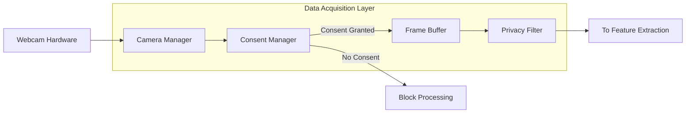
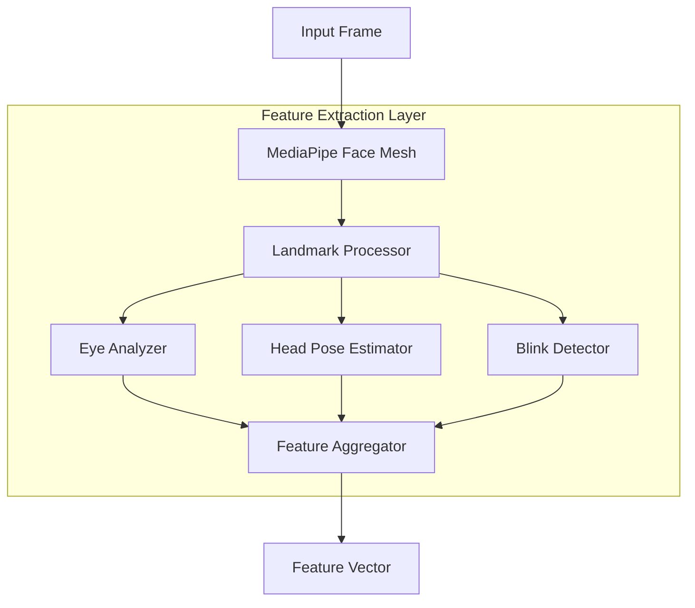
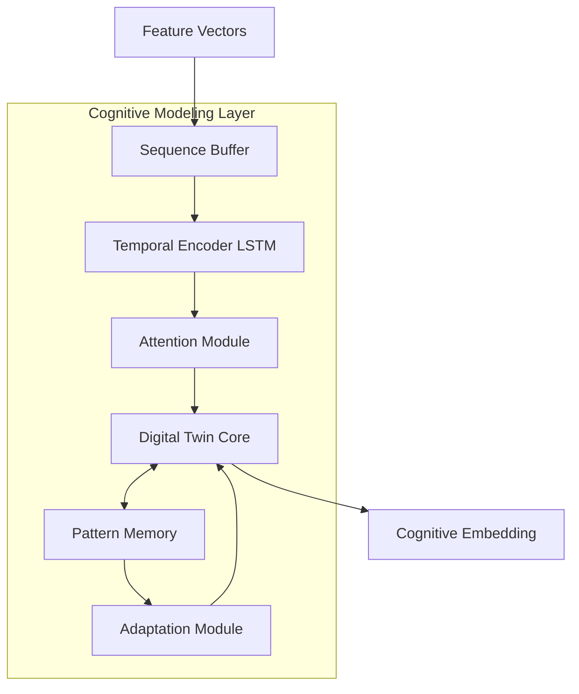
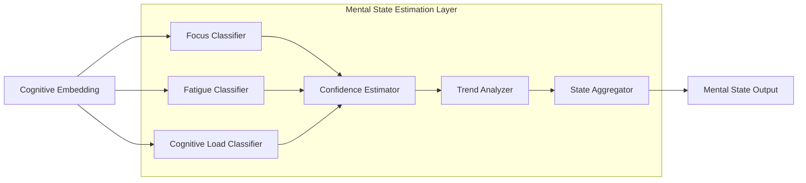
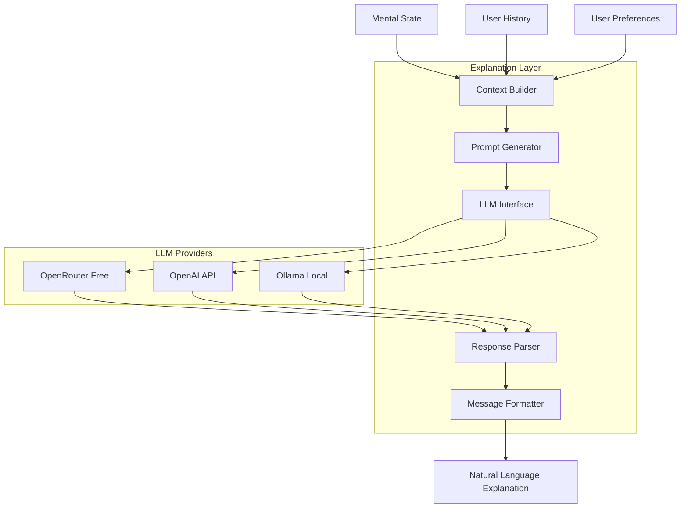
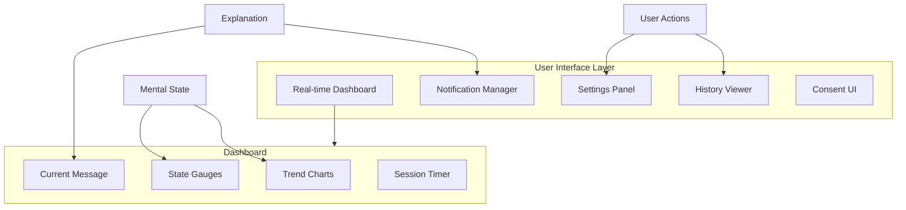

# System Architecture Overview
## Personal Cognitive Digital Twin

This document provides a detailed technical architecture for the Personal Cognitive Digital Twin system, including component specifications, interfaces, and implementation guidelines.

---

## Table of Contents

1. [Architecture Principles](#1-architecture-principles)
2. [System Layers](#2-system-layers)
3. [Component Specifications](#3-component-specifications)
4. [Module Interfaces](#4-module-interfaces)
5. [Deployment Architecture](#5-deployment-architecture)
6. [Scalability Considerations](#6-scalability-considerations)

---

## 1. Architecture Principles

### 1.1 Design Principles

| Principle | Description | Implementation |
|-----------|-------------|----------------|
| **Modularity** | Components are loosely coupled and independently deployable | Clear interfaces between layers |
| **Privacy by Default** | Most private options are the default | Local processing, no cloud by default |
| **Graceful Degradation** | System continues with reduced functionality on failures | Fallback mechanisms at each layer |
| **Real-Time First** | Optimized for low-latency processing | Streaming pipeline, efficient algorithms |
| **Extensibility** | Easy to add new features and models | Plugin architecture for models |
| **Testability** | All components are independently testable | Dependency injection, mock interfaces |

### 1.2 Architecture Style

The system employs a **Layered Pipeline Architecture** with the following characteristics:

```
┌─────────────────────────────────────────────────────────────────┐
│                     User Interface Layer                        │
├─────────────────────────────────────────────────────────────────┤
│                    Explanation Layer (GenAI)                    │
├─────────────────────────────────────────────────────────────────┤
│                   Mental State Estimation Layer                 │
├─────────────────────────────────────────────────────────────────┤
│                   Cognitive Modeling Layer                      │
├─────────────────────────────────────────────────────────────────┤
│                   Feature Extraction Layer                      │
├─────────────────────────────────────────────────────────────────┤
│                   Data Acquisition Layer                        │
└─────────────────────────────────────────────────────────────────┘
```

**Key Characteristics:**
- Unidirectional data flow (bottom to top)
- Each layer depends only on the layer below
- Horizontal scaling possible at each layer
- Clear separation of concerns

---

## 2. System Layers

### 2.1 Layer 1: Data Acquisition

**Purpose:** Capture video input with proper consent management.



**Components:**

| Component | Responsibility | Technology |
|-----------|---------------|------------|
| Camera Manager | Hardware interface, frame capture | OpenCV VideoCapture |
| Consent Manager | User consent handling, state persistence | Custom module |
| Frame Buffer | Circular buffer for frame sequencing | NumPy arrays |
| Privacy Filter | Optional face blurring, region masking | OpenCV |

**Output Specification:**
```python
@dataclass
class CapturedFrame:
    frame: np.ndarray      # Shape: (480, 640, 3), dtype: uint8
    timestamp: float       # Unix timestamp
    frame_id: int          # Sequential frame number
    camera_active: bool    # Camera status
```

### 2.2 Layer 2: Feature Extraction

**Purpose:** Extract meaningful behavioral features from video frames.



**Components:**

| Component | Responsibility | Output |
|-----------|---------------|--------|
| Face Mesh | 468 3D facial landmarks | (468, 3) array |
| Landmark Processor | Normalize and filter landmarks | Processed landmarks |
| Eye Analyzer | EAR, gaze direction | 6 features |
| Head Pose Estimator | Pitch, yaw, roll angles | 3 features |
| Blink Detector | Blink events, blink rate | 3 features |
| Feature Aggregator | Combine all features | 32D vector |

**Feature Vector Composition:**

| Feature Group | Dimensions | Description |
|---------------|------------|-------------|
| Eye features | 6 | EAR (L/R), gaze (x/y), pupil size (L/R) |
| Blink features | 3 | Blink detected, blink rate, blink duration avg |
| Head pose | 3 | Pitch, yaw, roll |
| Facial expression | 10 | Key AU (Action Unit) activations |
| Motion features | 6 | Head movement velocity, acceleration |
| Quality features | 4 | Face confidence, lighting, distance, angle |
| **Total** | **32** | |

### 2.3 Layer 3: Cognitive Modeling

**Purpose:** Build personalized temporal behavioral patterns (Digital Twin core).



**Components:**

| Component | Responsibility | Technology |
|-----------|---------------|------------|
| Sequence Buffer | Maintain sliding window of features | Ring buffer |
| Temporal Encoder | Learn temporal dependencies | Bi-LSTM (PyTorch) |
| Attention Module | Focus on relevant time steps | Self-attention |
| Digital Twin Core | User-specific cognitive model | Custom model |
| Pattern Memory | Store learned patterns | SQLite + PyTorch |
| Adaptation Module | Online learning updates | Continual learning |

**Model Architecture:**

```
Input: (batch_size, sequence_length=60, feature_dim=32)
        │
        ▼
┌───────────────────────────┐
│  Bidirectional LSTM       │
│  hidden_size=128          │
│  num_layers=2             │
│  dropout=0.3              │
└───────────────────────────┘
        │
        ▼
┌───────────────────────────┐
│  Self-Attention Layer     │
│  heads=4                  │
└───────────────────────────┘
        │
        ▼
┌───────────────────────────┐
│  Personal Adapter         │
│  (user-specific weights)  │
└───────────────────────────┘
        │
        ▼
Output: (batch_size, embedding_dim=64)
```

### 2.4 Layer 4: Mental State Estimation

**Purpose:** Classify current cognitive states from embeddings.



**Components:**

| Component | Responsibility | Output |
|-----------|---------------|--------|
| Focus Classifier | Estimate attention level | 0-100 score |
| Fatigue Classifier | Estimate tiredness level | 0-100 score |
| CogLoad Classifier | Estimate mental effort | 0-100 score |
| Confidence Estimator | Reliability of predictions | 0-1 score |
| Trend Analyzer | Detect changes over time | improving/stable/declining |
| State Aggregator | Combine all outputs | MentalState object |

**Classification Approach:**

Each classifier uses a multi-layer perceptron head:

```
Cognitive Embedding (64D)
        │
        ▼
┌───────────────────────────┐
│  Dense(64, 32), ReLU      │
│  Dropout(0.2)             │
│  Dense(32, 16), ReLU      │
│  Dense(16, 1), Sigmoid    │
└───────────────────────────┘
        │
        ▼
Score (0-1) × 100 → (0-100)
```

### 2.5 Layer 5: Explanation Generation

**Purpose:** Generate human-readable explanations using GenAI.



**Components:**

| Component | Responsibility | Notes |
|-----------|---------------|-------|
| Context Builder | Aggregate relevant context | Session data, patterns, preferences |
| Prompt Generator | Create LLM prompts | Template-based with variables |
| LLM Interface | Abstract provider interface | Supports OpenRouter, OpenAI, Ollama |
| Response Parser | Extract structured response | JSON parsing, validation |
| Message Formatter | Format for UI display | Markdown, notifications |

**Prompt Template Example:**

```
You are a supportive cognitive wellness assistant helping a user understand their mental state during work.

Current Mental State:
- Focus Level: {focus_level}/100
- Fatigue Level: {fatigue_level}/100  
- Cognitive Load: {cognitive_load}/100
- Trend: {trend}

Session Context:
- Duration: {session_duration} minutes
- Time of Day: {time_of_day}
- Recent Pattern: {pattern_summary}

User's typical patterns show:
{personal_patterns}

Generate a brief, supportive message (2-3 sentences) that:
1. Acknowledges their current state
2. Provides relevant context
3. Suggests one actionable step if needed

Use a warm, encouraging tone. Avoid technical jargon.
```

### 2.6 Layer 6: User Interface

**Purpose:** Present information and capture user interactions.



**UI Components:**

| Component | Technology | Purpose |
|-----------|------------|---------|
| Dashboard | Streamlit / PyQt | Main monitoring view |
| State Gauges | Custom widgets | Visual state display |
| Trend Charts | Plotly | Historical visualization |
| Notifications | System tray | Background alerts |
| Settings | Form components | User preferences |
| History | Data tables + charts | Session review |

---

## 3. Component Specifications

### 3.1 Camera Manager

```python
class CameraManager:
    """Manages webcam capture with proper resource handling."""
    
    def __init__(self, camera_id: int = 0, 
                 width: int = 640, 
                 height: int = 480,
                 fps: int = 30) -> None:
        """Initialize camera with specified parameters."""
        
    def start(self) -> bool:
        """Start video capture. Returns success status."""
        
    def stop(self) -> None:
        """Release camera resources."""
        
    def get_frame(self) -> Optional[CapturedFrame]:
        """Get next frame. Returns None if unavailable."""
        
    def is_active(self) -> bool:
        """Check if camera is currently capturing."""
        
    @property
    def fps(self) -> float:
        """Current actual FPS."""
```

### 3.2 Feature Extractor

```python
class FeatureExtractor:
    """Extracts behavioral features from video frames."""
    
    def __init__(self, config: FeatureConfig) -> None:
        """Initialize with MediaPipe and processing modules."""
        
    def extract(self, frame: CapturedFrame) -> Optional[FeatureVector]:
        """Extract all features from a single frame."""
        
    def extract_batch(self, frames: List[CapturedFrame]) -> List[FeatureVector]:
        """Batch extraction for efficiency."""
        
    def get_landmarks(self, frame: np.ndarray) -> Optional[LandmarkData]:
        """Extract facial landmarks only."""
        
    def get_eye_features(self, landmarks: LandmarkData) -> EyeFeatures:
        """Compute eye-related features."""
        
    def get_head_pose(self, landmarks: LandmarkData) -> HeadPose:
        """Estimate head pose angles."""
        
    def get_blink_features(self, landmarks: LandmarkData, 
                           history: List[float]) -> BlinkFeatures:
        """Detect blinks and compute blink rate."""
```

### 3.3 Cognitive Digital Twin

```python
class CognitiveDigitalTwin:
    """Personal cognitive model that learns user patterns."""
    
    def __init__(self, user_id: str, config: TwinConfig) -> None:
        """Initialize or load existing twin for user."""
        
    def update(self, features: FeatureVector) -> None:
        """Update twin with new observation."""
        
    def get_embedding(self) -> np.ndarray:
        """Get current cognitive embedding."""
        
    def get_state(self) -> MentalState:
        """Get current mental state estimation."""
        
    def save(self) -> None:
        """Persist twin to storage."""
        
    def load(self) -> bool:
        """Load twin from storage."""
        
    def adapt(self, feedback: UserFeedback) -> None:
        """Update model based on user feedback."""
        
    def get_patterns(self) -> Dict[str, Any]:
        """Get learned personal patterns."""
        
    def reset(self) -> None:
        """Reset personalization (keep base model)."""
```

### 3.4 Explanation Generator

```python
class ExplanationGenerator:
    """Generates natural language explanations using LLMs."""
    
    SUPPORTED_PROVIDERS = ["openrouter", "openai", "ollama"]
    
    def __init__(self, config: GenAIConfig) -> None:
        """Initialize with LLM provider configuration."""
        
    def generate(self, state: MentalState, 
                 context: UserContext) -> Explanation:
        """Generate explanation for current state."""
        
    async def generate_async(self, state: MentalState,
                             context: UserContext) -> Explanation:
        """Async generation for non-blocking UI."""
        
    def set_provider(self, provider: str) -> None:
        """Switch between 'openrouter', 'openai', and 'ollama'."""
        
    def get_prompt(self, state: MentalState, 
                   context: UserContext) -> str:
        """Get the prompt that would be sent to LLM."""
        
    def validate_response(self, response: str) -> bool:
        """Validate LLM response quality."""
```

### 3.5 OpenRouter Provider (Free Models)

```python
class OpenRouterProvider:
    """OpenRouter LLM provider with free model support."""
    
    # Free models available on OpenRouter (no credit card required)
    FREE_MODELS = [
        "meta-llama/llama-3.1-8b-instruct:free",   # Recommended
        "meta-llama/llama-3.2-3b-instruct:free",   # Fastest
        "google/gemma-2-9b-it:free",               # Good reasoning
        "mistralai/mistral-7b-instruct:free",      # Efficient
        "qwen/qwen-2-7b-instruct:free",            # Multilingual
        "microsoft/phi-3-mini-128k-instruct:free", # Long context
    ]
    
    def __init__(self, config: dict):
        """Initialize with OpenRouter configuration."""
        from openai import OpenAI
        
        self.client = OpenAI(
            base_url="https://openrouter.ai/api/v1",
            api_key=config.get("api_key"),
        )
        self.model = config.get("model", self.FREE_MODELS[0])
        self.max_tokens = config.get("max_tokens", 150)
        self.temperature = config.get("temperature", 0.7)
        
    async def generate(self, prompt: str) -> str:
        """Generate explanation using OpenRouter free models."""
        response = self.client.chat.completions.create(
            model=self.model,
            messages=[
                {
                    "role": "system",
                    "content": "You are a supportive cognitive wellness assistant."
                },
                {
                    "role": "user", 
                    "content": prompt
                }
            ],
            max_tokens=self.max_tokens,
            temperature=self.temperature,
            extra_headers={
                "HTTP-Referer": "https://cognitive-twin.app",
                "X-Title": "Cognitive Digital Twin"
            }
        )
        return response.choices[0].message.content
    
    @property
    def model_name(self) -> str:
        """Return the model identifier."""
        return self.model
```

**OpenRouter Configuration:**

```json
{
  "genai": {
    "provider": "openrouter",
    "model": "meta-llama/llama-3.1-8b-instruct:free",
    "api_key": "sk-or-v1-xxxxx",
    "base_url": "https://openrouter.ai/api/v1",
    "max_tokens": 150,
    "temperature": 0.7
  }
}
```

**Free Tier Limits:**
- ~20 requests/minute
- No credit card required
- Access to multiple free models

---

## 4. Module Interfaces

### 4.1 Inter-Layer Communication

All layers communicate through well-defined data classes:

```python
# Layer 1 → Layer 2
CapturedFrame → FeatureExtractor

# Layer 2 → Layer 3
FeatureVector → CognitiveDigitalTwin

# Layer 3 → Layer 4
CognitiveEmbedding → StateEstimators

# Layer 4 → Layer 5
MentalState + UserContext → ExplanationGenerator

# Layer 5 → Layer 6
Explanation → UI Components
```

### 4.2 Event System

The system uses an event-driven architecture for cross-cutting concerns:

```python
class EventBus:
    """Central event bus for system-wide communication."""
    
    # Event types
    FRAME_CAPTURED = "frame_captured"
    FEATURES_EXTRACTED = "features_extracted"
    STATE_UPDATED = "state_updated"
    EXPLANATION_READY = "explanation_ready"
    ALERT_TRIGGERED = "alert_triggered"
    CONSENT_CHANGED = "consent_changed"
    ERROR_OCCURRED = "error_occurred"
    
    def subscribe(self, event_type: str, 
                  callback: Callable) -> None: ...
    def publish(self, event_type: str, 
                data: Any) -> None: ...
    def unsubscribe(self, event_type: str, 
                    callback: Callable) -> None: ...
```

### 4.3 Configuration Interface

```python
@dataclass
class SystemConfig:
    """Root configuration for the entire system."""
    acquisition: AcquisitionConfig
    features: FeatureConfig
    cognitive: CognitiveConfig
    estimation: EstimationConfig
    genai: GenAIConfig
    ui: UIConfig
    privacy: PrivacyConfig
    
    @classmethod
    def from_file(cls, path: str) -> "SystemConfig": ...
    def to_file(self, path: str) -> None: ...
    def validate(self) -> List[str]: ...  # Returns validation errors
```

---

## 5. Deployment Architecture

### 5.1 Local Desktop Deployment

```
┌─────────────────────────────────────────────────────────────┐
│                      User's Computer                         │
│  ┌─────────────────────────────────────────────────────────┐ │
│  │                   Application Process                    │ │
│  │  ┌─────────────┐  ┌─────────────┐  ┌─────────────────┐  │ │
│  │  │   Camera    │  │   Feature   │  │    Cognitive    │  │ │
│  │  │   Module    │──│  Extraction │──│   Digital Twin  │  │ │
│  │  └─────────────┘  └─────────────┘  └─────────────────┘  │ │
│  │         │                                    │           │ │
│  │         │              ┌─────────────────────┤           │ │
│  │         │              │                     │           │ │
│  │  ┌──────▼──────┐  ┌────▼────────┐  ┌────────▼────────┐  │ │
│  │  │   Privacy   │  │   Mental    │  │    Explanation  │  │ │
│  │  │   Filter    │  │   State     │  │    Generator    │  │ │
│  │  └─────────────┘  └─────────────┘  └─────────────────┘  │ │
│  │                           │                 │            │ │
│  │                    ┌──────▼─────────────────▼──────┐     │ │
│  │                    │         User Interface        │     │ │
│  │                    └───────────────────────────────┘     │ │
│  └─────────────────────────────────────────────────────────┘ │
│                                                               │
│  ┌─────────────────┐     ┌─────────────────┐                 │
│  │  SQLite DB      │     │  Ollama (LLM)   │                 │
│  │  (User Data)    │     │  (Local)        │                 │
│  └─────────────────┘     └─────────────────┘                 │
└─────────────────────────────────────────────────────────────┘
```

**Characteristics:**
- Single process application
- All data stored locally
- Optional local LLM (Ollama)
- No internet required

### 5.2 Hybrid Cloud Deployment

```
┌─────────────────────────────────────────┐      ┌──────────────────┐
│             User's Computer             │      │   Cloud Services │
│  ┌───────────────────────────────────┐  │      │                  │
│  │        Local Processing           │  │      │  ┌────────────┐  │
│  │  Camera → Features → Cognitive    │  │      │  │  OpenAI    │  │
│  │                                   │  │ HTTPS │  │  API       │  │
│  │  ┌─────────────────────────────┐  │◄─┼──────┼──│            │  │
│  │  │      Mental State           │  │  │      │  └────────────┘  │
│  │  │      (Aggregated)           │──┼──┼──────►                  │
│  │  └─────────────────────────────┘  │  │      └──────────────────┘
│  └───────────────────────────────────┘  │
│                                         │
│  Only aggregated mental state scores    │
│  are sent to cloud (no video/images)    │
└─────────────────────────────────────────┘
```

**Data Sent to Cloud:**
- Mental state scores (focus, fatigue, cognitive load)
- Session duration
- User preferences (for personalized responses)
- **NOT sent:** Video, images, facial landmarks, raw features

### 5.3 Directory Structure

```
cognitive-twin/
├── src/
│   ├── __init__.py
│   ├── main.py                    # Application entry point
│   ├── config.py                  # Configuration management
│   │
│   ├── acquisition/               # Layer 1
│   │   ├── __init__.py
│   │   ├── camera.py
│   │   ├── consent.py
│   │   └── frame_buffer.py
│   │
│   ├── features/                  # Layer 2
│   │   ├── __init__.py
│   │   ├── extractor.py
│   │   ├── face_mesh.py
│   │   ├── eye_analyzer.py
│   │   ├── head_pose.py
│   │   └── blink_detector.py
│   │
│   ├── cognitive/                 # Layer 3
│   │   ├── __init__.py
│   │   ├── digital_twin.py
│   │   ├── temporal_model.py
│   │   ├── attention.py
│   │   └── adaptation.py
│   │
│   ├── estimation/                # Layer 4
│   │   ├── __init__.py
│   │   ├── focus.py
│   │   ├── fatigue.py
│   │   ├── cognitive_load.py
│   │   └── trend.py
│   │
│   ├── explanation/               # Layer 5
│   │   ├── __init__.py
│   │   ├── generator.py
│   │   ├── prompts.py
│   │   ├── providers/
│   │   │   ├── __init__.py
│   │   │   ├── openai_provider.py
│   │   │   ├── openrouter_provider.py
│   │   │   └── ollama_provider.py
│   │   └── templates/
│   │       └── default.txt
│   │
│   ├── ui/                        # Layer 6
│   │   ├── __init__.py
│   │   ├── dashboard.py
│   │   ├── notifications.py
│   │   ├── history.py
│   │   ├── settings.py
│   │   └── components/
│   │       ├── gauges.py
│   │       └── charts.py
│   │
│   ├── storage/                   # Data persistence
│   │   ├── __init__.py
│   │   ├── database.py
│   │   └── models.py
│   │
│   └── utils/                     # Shared utilities
│       ├── __init__.py
│       ├── events.py
│       ├── logging.py
│       └── validation.py
│
├── models/                        # Pre-trained models
│   ├── temporal_encoder.pt
│   └── state_classifiers.pt
│
├── data/                          # User data (gitignored)
│   ├── sessions.db
│   └── patterns/
│
├── config/
│   ├── default.json
│   └── schema.json
│
├── tests/
│   ├── unit/
│   ├── integration/
│   └── fixtures/
│
├── docs/
│   ├── PRD.md
│   └── architecture/
│
├── requirements.txt
├── pyproject.toml
└── README.md
```

---

## 6. Scalability Considerations

### 6.1 Performance Optimization

| Bottleneck | Optimization Strategy |
|------------|----------------------|
| Face detection | Use GPU if available, reduce resolution |
| Feature extraction | Batch processing, skip similar frames |
| Temporal model | Quantized model, ONNX runtime |
| LLM generation | Async calls, response caching |
| UI updates | Throttled updates, virtual rendering |

### 6.2 Resource Management

```python
class ResourceManager:
    """Manages system resources for optimal performance."""
    
    def __init__(self, config: ResourceConfig):
        self.max_memory_mb = config.max_memory_mb
        self.target_cpu_percent = config.target_cpu_percent
        
    def should_skip_frame(self) -> bool:
        """Determine if frame should be skipped for performance."""
        
    def get_processing_quality(self) -> str:
        """Return 'high', 'medium', or 'low' based on resources."""
        
    def monitor_resources(self) -> ResourceStatus:
        """Get current resource utilization."""
```

### 6.3 Future Extensibility

The architecture supports future enhancements:

| Enhancement | Architecture Support |
|-------------|---------------------|
| Additional mental states | New classifier modules in Layer 4 |
| Voice analysis | New feature extractor in Layer 2 |
| Multi-modal input | Extended acquisition layer |
| Cloud sync | Optional storage backend |
| Team features | Multi-user pattern database |
| Mobile companion | API layer for remote access |

---

*This architecture document provides the technical foundation for implementing the Personal Cognitive Digital Twin system. For data flow details, see [data-flow.md](data-flow.md).*
